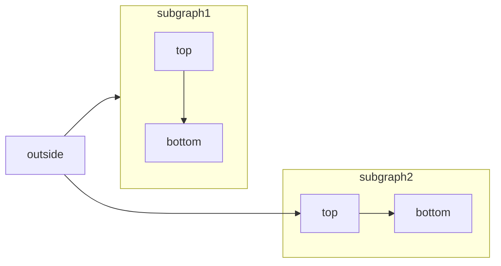

<RequestExample>
  ````md Mermaid Flowchart Example
  ```mermaid
    flowchart LR
      subgraph subgraph1
          direction TB
          top1[top] --> bottom1[bottom]
      end
      subgraph subgraph2
          direction TB
          top2[top] --> bottom2[bottom]
      end
      %% ^ These subgraphs are identical, except for the links to them:

      %% Link *to* subgraph1: subgraph1 direction is maintained
      outside --> subgraph1
      %% Link *within* subgraph2:
      %% subgraph2 inherits the direction of the top-level graph (LR)
      outside ---> top2
  ```
  ````
</RequestExample>

[Mermaid](https://mermaid.js.org/)te permite crear diagramas visuales usando texto y código.



Puedes crear lo siguiente usando diagramas Mermaid:

* Diagrama de flujo
* Diagrama de secuencia
* Diagrama de clases
* Diagrama de estado
* Diagrama de relación de entidades
* Viaje del usuario
* y más

Para una lista completa de diagramas soportados por Mermaid, consulta su[sitio web](https://mermaid.js.org/).

## Sintaxis para diagramas Mermaid

Para crear un diagrama de flujo, puedes escribir el diagrama de flujo Mermaid dentro de un bloque de código Mermaid.

````md
```mermaid
// Your mermaid code block here
```
````
