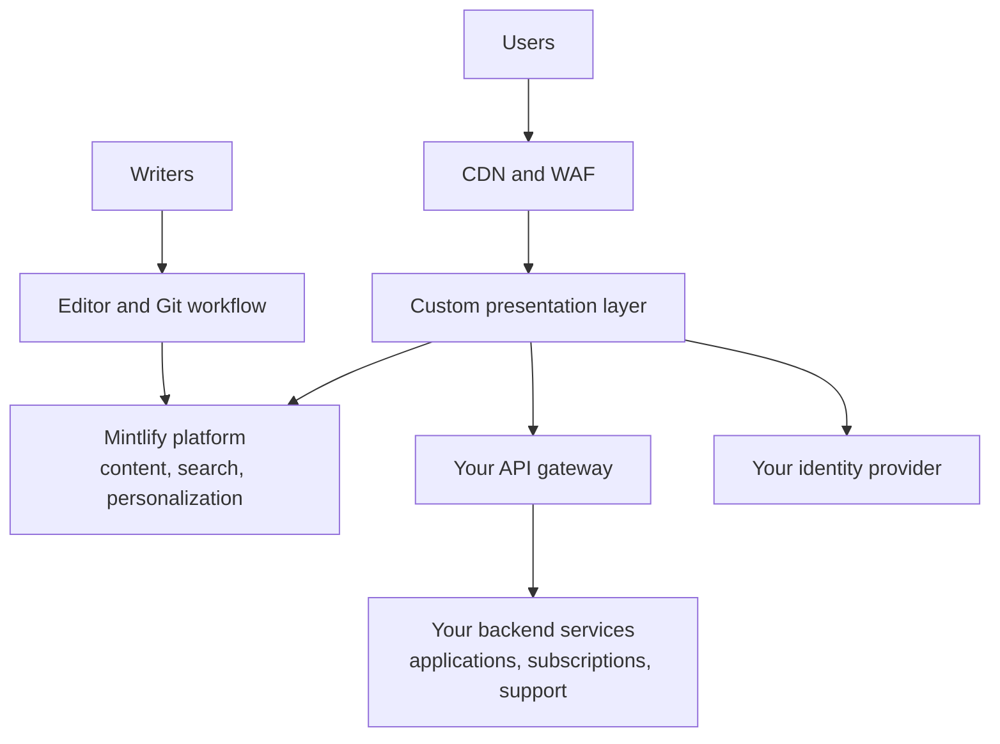

<Info>
  Los portales personalizados requieren un [plan Enterprise](https://mintlify.com/pricing?ref=custom-portal) y un [despliegue autoalojado](/es/deploy/self-host). Ponte en contacto con tu equipo de cuenta para dimensionar uno.
</Info>

En algunas plataformas, la documentación es solo una de las superficies de un producto más amplio: un marketplace de APIs, un portal para partners o una experiencia para desarrolladores con inicio de sesión, credenciales y soporte integrados. Mintlify cubre estos casos de uso diseñando, construyendo y manteniendo una capa de presentación personalizada que reemplaza el front-end de tu portal actual, mientras tu equipo redacta el contenido a través del editor de Mintlify o de un flujo de trabajo basado en Git.

El portal se integra con tus APIs, tu gateway y tus sistemas subyacentes existentes, que siguen siendo propiedad de tu equipo y operados por él.

  ## Características

| Característica | Qué se entrega | Respaldado por |
| --- | --- | --- |
| Capa de presentación personalizada | Una aplicación de front-end completa con tu sistema de diseño, desplegada dentro de tu entorno | Mintlify, junto con la plataforma autoalojada |
| Páginas de producto y catálogo | Marketplace, descubrimiento de productos y superficies de documentación | Contenido mantenido en Mintlify |
| Inicio de sesión | Sesiones autenticadas en todo el portal | Tu proveedor de identidad |
| Aplicaciones y credenciales | Registro de aplicaciones y gestión de credenciales | Tus APIs de backend |
| Suscripciones | Suscripciones a productos y planes | Tus APIs de backend |
| Perfiles y notificaciones | Perfiles de usuario y centros de notificaciones | Tus APIs de backend |
| Soporte | Creación y seguimiento de tickets de soporte | Tus APIs de backend |
| Búsqueda | Búsqueda contextual al inicio de sesión, limitada a lo que el usuario puede acceder | Plataforma de Mintlify |
| Contenido personalizado | Filtrado basado en permisos y grupos aplicado en el servidor en el momento del renderizado, de modo que los usuarios solo ven los productos y páginas a los que tienen acceso | Plataforma de Mintlify y tu proveedor de identidad |
| Versiones continuas | Versiones publicadas con guías de actualización, el mismo modelo operativo que cualquier [despliegue autoalojado](/es/deploy/self-host#updates) | Mintlify |

  ## Flujo de redacción

El front-end personalizado no afecta a la forma en que se escribe el contenido. Mantén el contenido con el editor o con un flujo de trabajo local basado en Git. Cada cambio pasa por el proceso de revisión de tu repositorio con un rastro de auditoría completo, y la publicación desencadena builds que actualizan el portal automáticamente. Los cambios de contenido no requieren un despliegue del front-end.

  ## Arquitectura

La capa de presentación personalizada se integra con la plataforma autoalojada de Mintlify para contenido, búsqueda y personalización; con tu gateway de APIs para aplicaciones, suscripciones y soporte; y con tu proveedor de identidad para la autenticación.

La capa de presentación personalizada y la plataforma de Mintlify se ejecutan dentro del perímetro de tu red, utilizando tu clúster, tus almacenes de datos y tu stack de observabilidad, sin salida a terceros. Tus sistemas de registro subyacentes permanecen sin cambios; el portal accede a ellos a través de tus APIs existentes.

  ## Cómo se desarrolla el proyecto

<Steps>
  <Step title="Alcance y diseño">
    Tu equipo de cuenta mapea las superficies del portal, tu sistema de diseño y las APIs de backend que consume el portal, y acuerda un contrato de integración con tu equipo de plataforma.
  </Step>
  <Step title="Primero las superficies públicas">
    El proyecto normalmente implementa primero tu sistema de diseño y las superficies de contenido públicas, para que puedas validar la experiencia frente a tu portal actual antes de la migración.
  </Step>
  <Step title="Superficies autenticadas">
    A continuación llegan el inicio de sesión, la gestión de credenciales, las suscripciones y otras experiencias con sesión iniciada, integradas con tu proveedor de identidad y tus APIs de backend.
  </Step>
  <Step title="Búsqueda, personalización e IA">
    La búsqueda contextual al inicio de sesión y la personalización en el servidor completan la experiencia principal. Las funciones opcionales de IA permanecen deshabilitadas hasta que tu equipo de seguridad o de gobierno de IA las apruebe.
  </Step>
</Steps>

Durante todo el proceso, tu equipo revisa las versiones en entornos no productivos y controla cada migración.

  ## Próximos pasos

<Columns cols={2}>
  <Card title="Habla con tu equipo de cuenta" icon="messages-square" href="https://www.mintlify.com/enterprise">
    Dimensiona un proyecto de portal personalizado y planifica tu lanzamiento.
  </Card>
  <Card title="Autoalojamiento" icon="server" href="/es/deploy/self-host">
    La base de despliegue sobre la que se ejecuta un portal personalizado.
  </Card>
</Columns>
