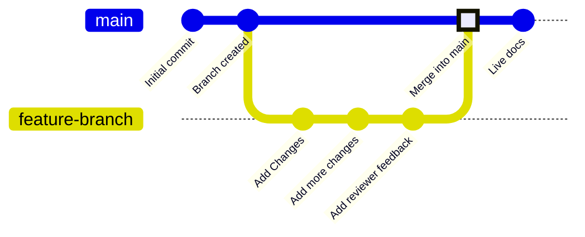

Las branches son una función del control de versiones que apuntan a confirmaciones específicas en tu repositorio. Tu rama de implementación, generalmente llamada `main`, representa el contenido que se usa para compilar tu sitio de documentación en producción. Todas las demás branches son independientes de tu sitio en producción a menos que decidas fusionarlas en tu rama de implementación.

Las branches te permiten crear instancias separadas de tu documentación para realizar cambios, obtener revisiones y probar nuevos enfoques antes de publicar. Tu equipo puede trabajar en branches para actualizar diferentes partes de tu documentación al mismo tiempo, sin afectar lo que los usuarios ven en tu sitio en producción.

El siguiente diagrama muestra un ejemplo de flujo de trabajo con branches en el que se crea una branch de funcionalidad, se realizan cambios y luego la branch de funcionalidad se fusiona en la branch principal.



Recomendamos trabajar siempre desde branches al actualizar la documentación para mantener estable tu sitio en producción y habilitar flujos de revisión.


<div id="branch-naming-conventions">
  ## Convenciones para nombrar branches
</div>

Usa nombres claros y descriptivos que indiquen el propósito de un branch.

**Usa**:

- `fix-broken-links`
- `add-webhooks-guide`
- `reorganize-getting-started`
- `ticket-123-oauth-guide`

**Evita**:

- `temp`
- `my-branch`
- `updates`
- `branch1`

<div id="create-a-branch">
  ## Crear una rama
</div>

<Tabs>
  <Tab title="Usando el editor web">
    1. Haz clic en el nombre de la rama en la barra de herramientas del editor.
    1. Haz clic en **Nueva rama**.
    1. Escribe un nombre descriptivo.
    1. Haz clic en **Crear rama**.
  </Tab>

  <Tab title="Usando desarrollo local">
    <Steps>
      <Step title="Crea una rama desde tu terminal">
        ```bash
        git checkout -b branch-name
        ```
        
        Esto crea la rama y cambia a ella en un solo comando.
      </Step>
      <Step title="Envía la rama a GitHub">
        ```bash
        git push -u origin branch-name
        ```

        La opción `-u` configura el seguimiento para que en futuros envíos solo necesites ejecutar `git push`.
      </Step>
    </Steps>
  </Tab>
</Tabs>

<div id="save-changes-on-a-branch">
  ## Guardar cambios en una branch
</div>

<Tabs>
  <Tab title="Usar el editor web">
    Selecciona el botón **Save as commit** en la parte superior derecha de la barra de herramientas del editor. Esto crea una confirmación y sube tu trabajo a tu branch automáticamente.
  </Tab>

  <Tab title="Usar desarrollo local">
    Prepara, confirma y sube tus cambios.

    ```bash
    git add .
    git commit -m "Describe your changes"
    git push
    ```
  </Tab>
</Tabs>

<div id="switch-branches">
  ## Cambiar de branch
</div>

<Tabs>
  <Tab title="Usar el editor web">
    1. Selecciona el nombre del branch en la barra de herramientas del editor.
    1. Selecciona el branch al que quieres cambiar en el menú desplegable.

    <Warning>
      Los cambios sin guardar se pierden al cambiar de branch. Guarda tu trabajo primero.
    </Warning>
  </Tab>

  <Tab title="Usar el entorno de desarrollo local">
    Cambia a un branch existente:

    ```bash
    git checkout branch-name
    ```

    O crea y cambia en un solo comando:

    ```bash
    git checkout -b new-branch-name
    ```

  </Tab>
</Tabs>

<div id="merge-branches">
  ## Fusionar branches
</div>

Cuando tus cambios estén listos para su publicación, crea una solicitud de extracción para fusionar tu branch en la rama de implementación.