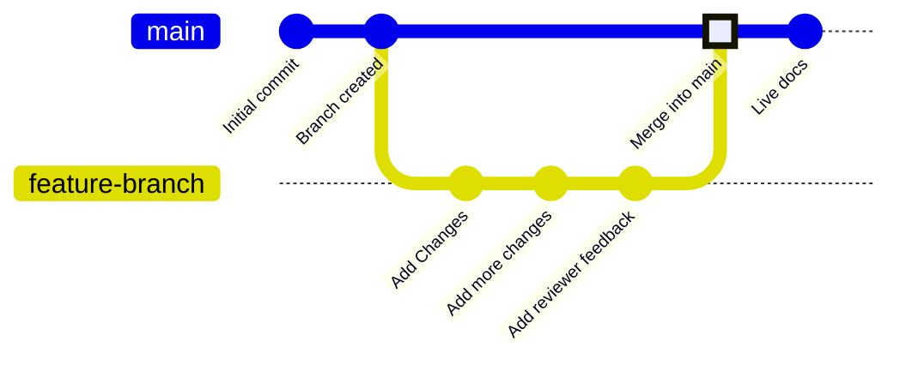

Las branches son una función del control de versiones que apuntan a commits concretos de tu repositorio. Tu deployment branch, normalmente llamada `main`, representa el contenido que se usa para compilar tu sitio de documentación en producción. Todas las demás branches son independientes de tu sitio en producción a menos que decidas fusionarlas en tu deployment branch.

Las branches te permiten crear instancias separadas de tu documentación para hacer cambios, obtener revisiones y probar nuevos enfoques antes de publicar. Tu equipo puede trabajar en branches para actualizar distintas partes de tu documentación al mismo tiempo sin afectar a lo que los usuarios ven en tu sitio en producción.

El siguiente diagrama muestra un ejemplo de flujo de trabajo con branches en el que creas una feature branch, haces cambios y luego fusionas la feature branch en la branch main.


```mermaid
gitGraph
    commit id: "Initial commit"
    commit id: "Branch created"
    branch feature-branch
    checkout feature-branch
    commit id: "Add Changes"
    commit id: "Add more changes"
    checkout main
    checkout feature-branch
    commit id: "Add reviewer feedback"
    checkout main
    merge feature-branch id: "Merge into main" type: HIGHLIGHT
    commit id: "Live docs"
```

Trabaja siempre desde branches al actualizar la documentación para mantener estable tu sitio en producción y habilitar los flujos de revisión.

<div id="branch-naming-conventions">
  ## Convenciones para nombrar branches
</div>

Usa nombres claros y descriptivos que expliquen el propósito de una branch.

**Usa**:

- `fix-broken-links`
- `add-webhooks-guide`
- `reorganize-getting-started`
- `ticket-123-oauth-guide`

**Evita**:

- `temp`
- `my-branch`
- `updates`
- `branch1`

<div id="create-a-branch">
  ## Crear una branch
</div>

<Tabs>
  <Tab title="Usando el editor web">
    1. Haz clic en el nombre de la branch en la barra de herramientas del editor. Si no lo ves, [muestra el selector de branch](/es/editor/publish#show-the-branch-selector).
    1. En **Find a branch**, escribe un título descriptivo. Si lo dejas vacío, el editor nombra la branch con la fecha actual.
    1. Haz clic en **New branch**.
    1. Si tienes cambios pendientes, elige **Bring them to this branch** o **Leave them behind**. Tu branch original conserva sus cambios pendientes en cualquier caso.
  </Tab>
  <Tab title="Usando desarrollo local">
    <Steps>
      <Step title="Crea una branch desde tu terminal">
        ```bash
        git checkout -b branch-name
        ```

        Esto crea la branch y cambia a ella en un solo comando.
      </Step>
      <Step title="Envía la branch a GitHub">
        ```bash
        git push -u origin branch-name
        ```

        La opción `-u` configura el seguimiento para que en futuros pushes solo necesites ejecutar `git push`.
      </Step>
    </Steps>
  </Tab>
</Tabs>

<div id="save-changes-on-a-branch">
  ## Guardar cambios en una branch
</div>

<Tabs>
  <Tab title="Usando el editor web">
    No necesitas guardar manualmente. El editor hace commit de tus ediciones en la branch aproximadamente 15 segundos después de que dejes de editar. El primer commit abre una pull request contra tu deployment branch.
  </Tab>
  <Tab title="Usando desarrollo local">
    Prepara, confirma y envía tus cambios.

    ```bash
    git add .
    git commit -m "Describe your changes"
    git push
    ```
  </Tab>
</Tabs>

<div id="switch-branches">
  ## Cambiar de branch
</div>

<Tabs>
  <Tab title="Usando el editor web">
    1. Haz clic en el nombre de la branch en la barra de herramientas del editor para abrir el menú desplegable de branches.
    1. Busca una branch por nombre o desplázate por la lista.
    1. Haz clic en la branch a la que quieres cambiar.

    Cada branch del menú desplegable muestra un indicador de pull request para que puedas ver si la branch tiene una pull request abierta, en borrador, fusionada o cerrada, o si aún no tiene ninguna.

    Antes de buscar, el menú desplegable lista las branches creadas en el editor y las branches con una pull request abierta dirigida a tu deployment branch. La búsqueda por nombre también encuentra otras branches de tu repositorio, incluidas las branches enviadas directamente a través de Git y las branches con pull requests fusionadas o cerradas. Consulta [Una rama no aparece en la lista de ramas del editor web](/es/help-center/branch-missing-from-editor-branch-list).

    Tus cambios pendientes permanecen en la branch que dejas.
  </Tab>
  <Tab title="Usando desarrollo local">
    Cambia a una branch existente:

    ```bash
    git checkout branch-name
    ```

    O crea y cambia en un solo comando:

    ```bash
    git checkout -b new-branch-name
    ```
  </Tab>
</Tabs>

<div id="merge-branches">
  ## Hacer merge de branches
</div>

Cuando tus cambios estén listos para su publicación, haz merge de tu branch en la deployment branch.

<Tabs>
  <Tab title="Usando el editor">
    Si Mintlify aloja tu repositorio y tu branch no requiere aprobaciones, haz clic en **Publish** en la barra de herramientas del editor y luego en **Publish** para hacer merge de tu branch y publicar tus cambios.

    Si no:

    1. Haz clic en **Publish** en la barra de herramientas del editor y luego en **Request review**. Esto marca la pull request de tu branch como lista para revisión.
    1. Completa las revisiones y comprobaciones requeridas.
    1. Haz clic en **Publish** y luego en **Merge and publish**.

    Consulta [Publicar cambios](/es/editor/publish) para saber cómo cambian las acciones de publicación disponibles según tu branch y las protecciones de branch.
  </Tab>
  <Tab title="Usando desarrollo local">
    Envía tu branch y luego abre una pull request en tu proveedor de Git dirigida a tu deployment branch. Después de que la pull request se fusione, Mintlify compila y despliega tus cambios en tu sitio en producción.
  </Tab>
</Tabs>

<div id="delete-a-branch">
  ## Eliminar una branch
</div>

Elimina las branches que ya no necesites para mantener manejable el menú desplegable de branches.

<Tabs>
  <Tab title="Usando el editor web">
    1. Haz clic en el nombre de la branch en la barra de herramientas del editor para abrir el menú desplegable de branches.
    1. Pasa el cursor sobre la branch que quieres eliminar.
    1. Haz clic en el icono de papelera **Delete branch**.
    1. Haz clic en **Delete branch** para confirmar.

    Eliminar una branch cierra cualquier pull request abierta de la branch y elimina la branch de tu repositorio. No puedes eliminar tu deployment branch.
  </Tab>
  <Tab title="Usando desarrollo local">
    Elimina la branch localmente:

    ```bash
    git branch -d branch-name
    ```

    Luego elimínala de tu repositorio remoto:

    ```bash
    git push origin --delete branch-name
    ```
  </Tab>
</Tabs>
