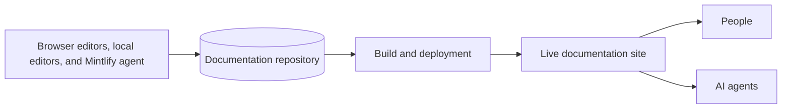

Mintlify convierte el contenido de un repositorio de Git en un sitio de documentación. Puedes trabajar desde el editor en tu navegador, tu entorno de desarrollo local o pedirle instrucciones al agente de Mintlify en Slack. Los tres flujos de trabajo actualizan el mismo repositorio. Mintlify convierte el contenido de tu repositorio en experiencias optimizadas para personas y agentes.

  ## Organizaciones, despliegues y sitios

Una **organización** es el espacio de trabajo para tu equipo. Contiene a tus miembros, la configuración a nivel de organización y uno o más despliegues.

Un **despliegue** es un proyecto de documentación en tu organización. Conecta un repositorio, un directorio de contenido y una rama de despliegue con un sitio publicado. Una organización puede tener varios despliegues para productos o propiedades de documentación distintos.

Un **sitio en vivo** es el resultado publicado de un despliegue. Mintlify proporciona una URL `.mintlify.site` de forma predeterminada. Puedes conectar un [dominio personalizado](/es/customize/custom-domain) para tu sitio. Los sitios incluyen tu contenido, navegación, búsqueda y cualquier función que habilites, como el asistente o el playground de la API.

<Note>
  La documentación a veces utiliza **proyecto** como un nombre general para un despliegue y su repositorio, configuración y sitio conectados.
</Note>

  ## El repositorio es la fuente de verdad

El repositorio de tu documentación contiene los archivos que definen tu sitio. Mintlify lee estos archivos durante cada build.

- Las **páginas** son archivos `.mdx`. Cada página contiene contenido y metadatos en el frontmatter.
- `docs.json` es el archivo de configuración obligatorio. Controla la navegación, la apariencia, las integraciones, la configuración de la API y otros comportamientos globales del sitio.
- Los **recursos** incluyen imágenes, vídeos, fuentes y archivos descargables a los que hacen referencia tus páginas.
- Las **especificaciones de API** pueden generar páginas de referencia de API y playgrounds interactivos a partir de esquemas OpenAPI, AsyncAPI o GraphQL.
- Los **archivos reutilizables** incluyen fragmentos y componentes personalizados de React que las páginas pueden importar.

Tu repositorio puede contener archivos no publicados. Una página aparece en la navegación del sitio solo cuando la referencias en la navegación de tu [`docs.json`](/es/organize/navigation); de lo contrario, permanece oculta. Las [páginas ocultas](/es/organize/hidden-pages) solo son accesibles mediante un enlace directo.

  ## Las páginas y la navegación son independientes

Una **página** proporciona el contenido en una URL. Su [frontmatter](/es/organize/pages) controla los metadatos y el comportamiento a nivel de página, incluidos su título, descripción, icono y diseño.

La **navegación** determina cómo los lectores se desplazan por las páginas. Configura la navegación en tu archivo `docs.json` usando elementos como grupos, pestañas, menús desplegables, productos, versiones e idiomas. La ruta del archivo identifica una página y su posición en `docs.json` determina dónde aparece en la navegación.

Esta separación te permite reorganizar la experiencia del lector sin mover archivos. También te permite excluir páginas de utilidad de la navegación mientras las mantienes disponibles por URL.

  ## Editar y publicar son etapas diferentes

Puedes editar el mismo contenido mediante dos flujos de trabajo principales.

| Flujo de trabajo | Dónde editas | Cómo llegan los cambios a Git | Cómo previsualizas |
| --- | --- | --- | --- |
| Editor | Panel de Mintlify en tu navegador | El editor crea commits y puede abrir solicitudes de extracción | Vista previa en vivo en el editor |
| Desarrollo local | Tu editor preferido | Haces commit y push con Git | Comando de CLI `mint dev` |

En el editor, los cambios se **guardan** automáticamente, pero no actualizan de inmediato tu repositorio ni tu sitio en vivo. Cuando **publicas**, el editor escribe los cambios en Git. Lo que ocurre a continuación depende de tu rama actual y de la configuración de protección de rama.

- En la **rama de despliegue**, publicar puede activar directamente un build del sitio en vivo.
- En una **rama de funcionalidad**, publicar puede guardar los cambios en la rama o crear una solicitud de extracción para su revisión.
- Un **despliegue de vista previa** renderiza una solicitud de extracción en una URL temporal para que los revisores puedan inspeccionar el resultado antes de fusionarla.
- Fusionar una solicitud de extracción en la rama de despliegue activa un despliegue de producción.

Consulta [Ramas y publicación](/es/editor/publish) para conocer el flujo de trabajo completo.

  ## Un build convierte los archivos fuente en experiencias para el lector

Cuando el contenido llega a la rama de despliegue, Mintlify valida el proyecto, renderiza las páginas y despliega el sitio. El mismo contenido fuente admite varias formas de encontrar y consumir información:

- El sitio de documentación renderiza páginas para personas en escritorio y móvil.
- La búsqueda indexa el sitio para que los lectores puedan encontrar las páginas relevantes.
- El asistente responde preguntas a partir de la documentación y cita sus fuentes.
- Las versiones en Markdown de las páginas, `llms.txt` y `skill.md` ayudan a las herramientas de IA a entender el contenido.
- Un servidor MCP público permite que las herramientas de IA compatibles recuperen la documentación como contexto estructurado.

Ejecuta [`mint validate`](/es/cli/commands#mint-validate) y [`mint broken-links`](/es/cli/commands#mint-broken-links) antes de publicar para detectar problemas comunes de forma local.

  ## Las funciones de IA de Mintlify tienen roles distintos

Mintlify ofrece funciones de IA independientes para leer, escribir, automatizar y acceder a herramientas externas.

| Función | Utilizado por | Propósito | Modifica el contenido |
| --- | --- | --- | --- |
| [Assistant](/es/assistant) | Lectores de la documentación | Responde preguntas a partir de tu contenido | No |
| [Agent](/es/agent) | Mantenedores de la documentación | Investiga y propone actualizaciones de contenido o configuración | Sí |
| [Automatizaciones](/es/automations/index) | Mantenedores de la documentación | Ejecuta el agente desde una programación, una actualización del repositorio o un evento de integración | Sí |
| [Servidor MCP de búsqueda](/es/ai/model-context-protocol) | Agentes | Recupera contexto de un sitio de documentación publicado | No |
| [Servidor MCP de administración](/es/ai/mintlify-mcp) | Agentes | Lee y actualiza despliegues mediante herramientas autenticadas | Sí |
| [Mintlify Index](/es/search-index) | Agentes | Recupera contexto técnico actualizado de todos los sitios públicos de Mintlify y de la web | No |

  ## Aprende la terminología

Consulta el [glosario](/es/reference/glossary) para conocer las definiciones de los términos de Mintlify, Git, publicación, navegación, API e IA que se utilizan a lo largo de la documentación.
