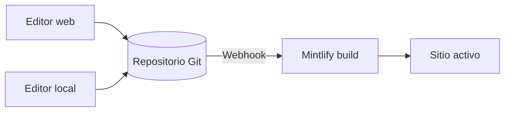

Mintlify aloja tu contenido como un sitio web. Tu contenido se almacena en un repositorio Git como archivos MDX, y Mintlify construye y despliega tu sitio automáticamente cuando haces push de un cambio.

  ## Las tres partes de un proyecto de Mintlify

**Tu repositorio** es la fuente de la verdad para tu documentación. Contiene un archivo MDX para cada página y un archivo `docs.json` que configura la navegación, el tema y los ajustes de tu sitio. Puedes usar tu propio repositorio de GitHub o GitLab, o dejar que Mintlify cree uno para ti durante la configuración inicial.

**El Dashboard de Mintlify** se conecta a tu repositorio y te permite gestionar tu sitio. Úsalo para supervisar las implementaciones, configurar los ajustes, gestionar a tu equipo y editar contenido directamente en el navegador.

**Tu sitio**, impulsado por Mintlify. Mintlify construye tu sitio a partir de tu repositorio y lo implementa en una URL `.mintlify.app` de forma predeterminada. Cuando estés listo, puedes asignar un dominio personalizado a tu sitio.

  ## Edición de contenido

Hay dos maneras de editar tu contenido, y puedes alternar entre ellas libremente.

* **Editor web**: Edita y publica páginas en tu navegador. El editor confirma automáticamente los cambios en tu repositorio de Git.
* **CLI y editor local**: Clona tu repositorio, ejecuta `mint dev` para previsualizar tu sitio de forma local y luego haz push de los cambios para desplegarlo.

Varios miembros del equipo pueden trabajar en cualquiera de los dos flujos al mismo tiempo, usando branches de Git para gestionar cambios en paralelo. Cualquiera que pueda hacer push a tu repositorio puede actualizar tu contenido.

  ## Funciones de IA

Las funciones de IA integradas ayudan a las personas y a la IA a encontrar y comprender tu contenido, y te ayudan a mantenerlo.

El **assistant** permite que tus usuarios hagan preguntas y obtengan respuestas citadas directamente de tu contenido.

El **agent** ayuda a tu equipo a crear y mantener contenido generando actualizaciones a partir de flujos de trabajo programados, solicitudes de extracción que se fusionan en tu repositorio de funcionalidades o hilos de Slack.

Consulta [documentación nativa con IA](/es/ai-native) para ver una descripción general de todas las funciones de IA.

  ## Próximos pasos

<Card title="Guía rápida" icon="rocket" horizontal href="/es/quickstart">
  Publica tu primer sitio de documentación en cuestión de minutos.
</Card>