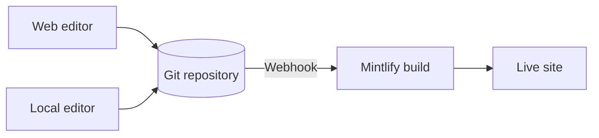

Mintlify aloja tu contenido como un sitio web. Tu contenido vive en un repositorio Git como archivos MDX, y Mintlify construye y despliega tu sitio automáticamente cuando haces push de un cambio.

  ## Las tres partes de un proyecto Mintlify

**Tu repositorio** es la fuente de verdad para tu documentación. Contiene un archivo MDX para cada página y un archivo `docs.json` que configura la navegación, el tema y los ajustes de tu sitio. Puedes usar tu propio repositorio de GitHub o GitLab, o dejar que Mintlify cree uno para ti durante la incorporación.

**El panel de Mintlify** se conecta a tu repositorio y te permite administrar tu sitio. Úsalo para monitorear despliegues, configurar ajustes, administrar tu equipo y editar contenido directamente en el navegador.

**Tu sitio** impulsado por Mintlify. Mintlify construye tu sitio desde tu repositorio y lo despliega en una URL `.mintlify.app` por defecto. Cuando estés listo, puedes apuntar un dominio personalizado a tu sitio.

  ## Edición de contenido

Hay dos formas de editar tu contenido, y puedes alternar entre ellas libremente.

- **Editor web**: Edita y publica páginas en tu navegador. El editor envía los cambios de vuelta a tu repositorio Git automáticamente.
- **CLI y editor local**: Clona tu repositorio, ejecuta `mint dev` para previsualizar tu sitio localmente, luego haz push de los cambios para desplegar.

Múltiples miembros del equipo pueden trabajar en cualquiera de los flujos de trabajo al mismo tiempo, usando ramas de Git para administrar cambios en paralelo. Cualquiera que pueda hacer push a tu repositorio puede actualizar tu contenido.

  ## Funciones de IA

Las funciones de IA integradas ayudan a las personas y a la IA a encontrar y comprender tu contenido, y te ayudan a mantener tu contenido.

El **asistente** permite a tus usuarios hacer preguntas y obtener respuestas citadas de tu contenido.

El **agente** ayuda a tu equipo a crear y mantener contenido generando actualizaciones desde flujos de trabajo programados, pull requests que se fusionan en tu repositorio de funciones, o hilos de Slack.

Consulta [Documentación nativa de IA](/es/ai-native) para obtener una descripción general de todas las funciones de IA.

  ## Próximos pasos

<Card title="Inicio rápido" icon="rocket" horizontal href="/es/quickstart">
  Despliega tu primer sitio de documentación en minutos.
</Card>
