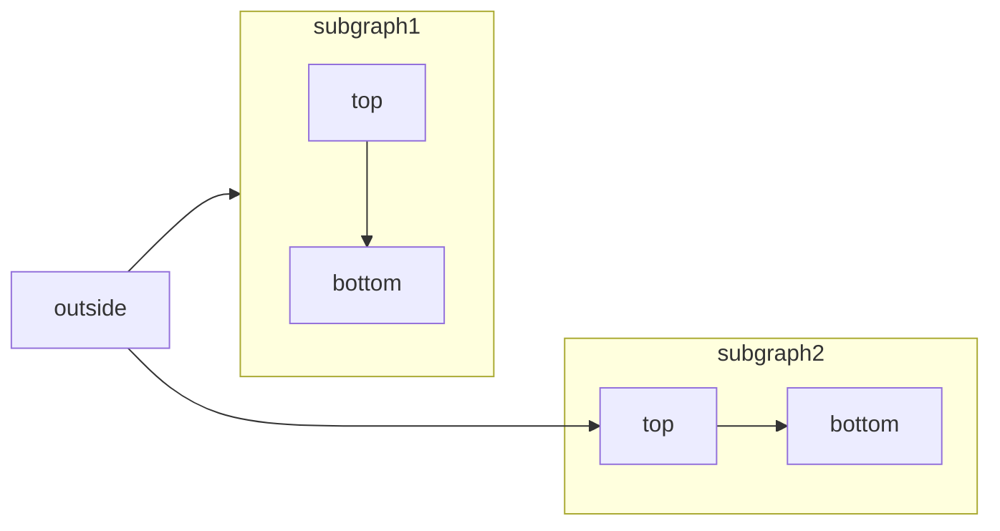
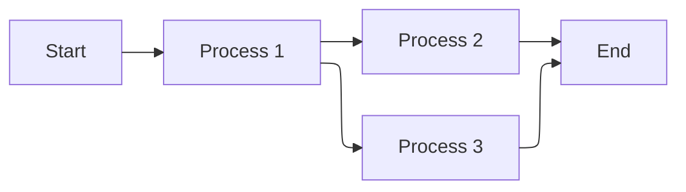
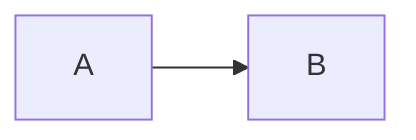

[Mermaid](https://mermaid.js.org/) permet de créer des organigrammes, des diagrammes de séquence, des diagrammes de Gantt et d’autres diagrammes à partir de texte et de code.

Pour la liste complète des types de diagrammes pris en charge et de leur syntaxe, consultez la [documentation Mermaid](https://mermaid.js.org/intro/).



````mdx Mermaid flowchart example

````


<div id="elk-layout-support">
  ## Prise en charge de la disposition ELK
</div>

Mintlify prend en charge le moteur de disposition [ELK (Eclipse Layout Kernel)](https://www.eclipse.org/elk/) pour les diagrammes Mermaid. ELK optimise l’agencement afin de réduire les chevauchements et d’améliorer la lisibilité, ce qui est particulièrement utile pour les diagrammes de grande taille ou complexes.

Pour utiliser la disposition ELK dans vos diagrammes Mermaid, ajoutez la directive `%%{init: {'flowchart': {'defaultRenderer': 'elk'}}}%%` au début de votre diagramme :

````mdx ELK layout example

````


<div id="interactive-controls">
  ## Contrôles interactifs
</div>

Tous les diagrammes Mermaid incluent des contrôles interactifs de zoom et de déplacement. Par défaut, les contrôles apparaissent lorsque l'attribut height du diagramme dépasse 120 px.

- **Zoom avant/arrière** : Utilisez les boutons de zoom pour augmenter ou diminuer l'échelle du diagramme.
- **Déplacement** : Utilisez les flèches directionnelles pour vous déplacer dans le diagramme.
- **Réinitialiser la vue** : Cliquez sur le bouton de réinitialisation pour revenir à la vue initiale.

Les contrôles sont particulièrement utiles pour les grands diagrammes ou les diagrammes complexes qui ne tiennent pas entièrement dans la fenêtre d'affichage.

<div id="properties">
  ## Propriétés
</div>

<ResponseField name="actions" type="boolean">
  Affiche ou masque les contrôles interactifs. Lorsqu’il est défini, ce paramètre remplace le comportement par défaut (contrôles affichés lorsque l’attribut height du diagramme dépasse 120&nbsp;px).
</ResponseField>

<ResponseField name="placement" type="string" default="bottom-right">
  Position des contrôles interactifs. Options&nbsp;: `top-left`, `top-right`, `bottom-left`, `bottom-right`.
</ResponseField>

<div id="examples">
  ### Exemples
</div>

Masquer les contrôles sur un diagramme :

````mdx

````

Afficher les contrôles en haut à gauche :

````mdx

````

Combinez ces deux propriétés :

````mdx

````


<div id="syntax">
  ## Syntaxe
</div>

Pour créer un diagramme Mermaid, écrivez la définition de votre diagramme dans un code block Mermaid.

````mdx
```mermaid
// Votre code de diagramme mermaid ici
```
````
