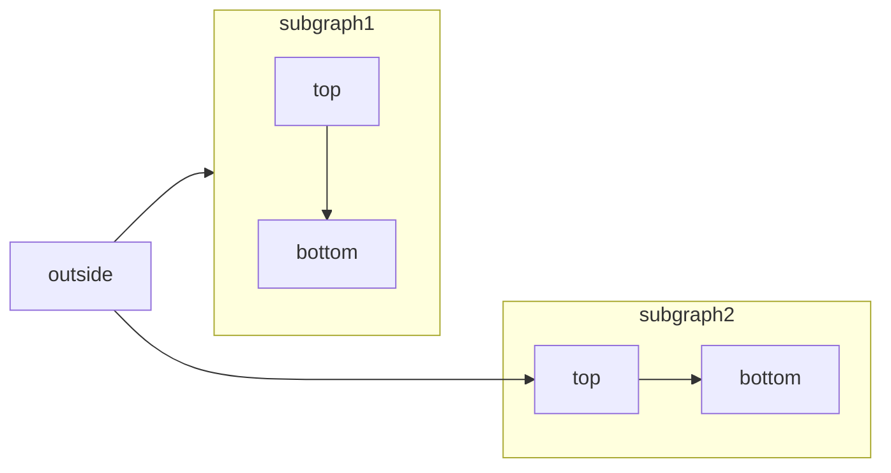

[Mermaid](https://mermaid.js.org/) permet de créer des organigrammes, des diagrammes de séquence, des diagrammes de Gantt et d’autres diagrammes à partir de texte et de code.

Pour la liste complète des types de diagrammes pris en charge et de leur syntaxe, consultez la [documentation Mermaid](https://mermaid.js.org/intro/).



````mdx Mermaid flowchart example

````


<div id="interactive-controls">
  ## Contrôles interactifs
</div>

Tous les diagrammes Mermaid incluent des contrôles interactifs de zoom et de déplacement qui apparaissent dans le coin inférieur droit du diagramme.

- **Zoom avant/arrière** : Utilisez les boutons de zoom pour augmenter ou diminuer l'échelle du diagramme.
- **Déplacement** : Utilisez les flèches directionnelles pour vous déplacer dans le diagramme.
- **Réinitialiser la vue** : Cliquez sur le bouton de réinitialisation pour revenir à la vue initiale.

Les contrôles sont particulièrement utiles pour les grands diagrammes ou les diagrammes complexes qui ne tiennent pas entièrement dans la fenêtre d'affichage.

<div id="syntax">
  ## Syntaxe
</div>

Pour créer un diagramme Mermaid, écrivez la définition de votre diagramme dans un code block Mermaid.

````mdx
```mermaid
// Votre code de diagramme mermaid ici
```
````
