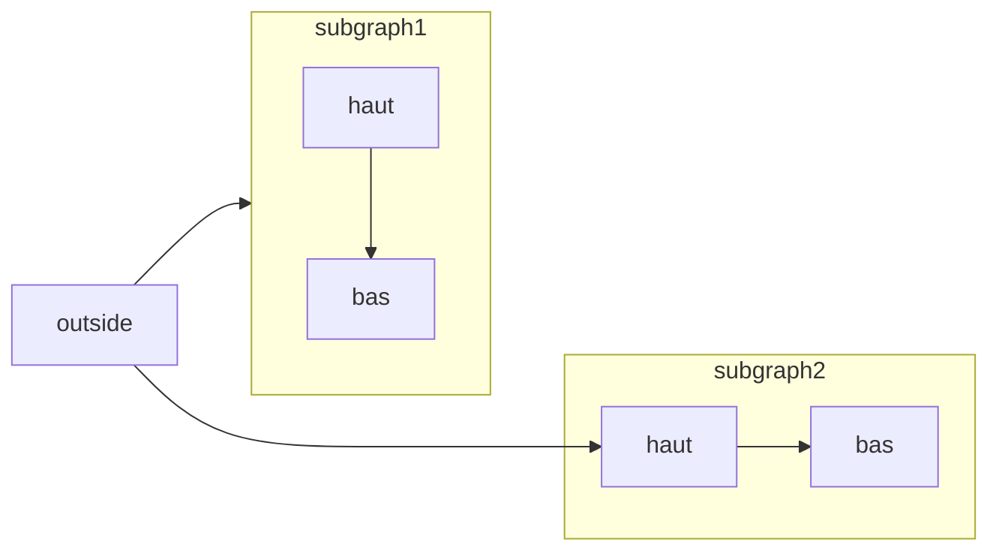

[Mermaid](https://mermaid.js.org/) vous permet de créer des organigrammes, des diagrammes de séquence, des diagrammes de Gantt et d&#39;autres diagrammes à partir de texte et de code.

Pour connaître la liste complète des types de diagrammes pris en charge et leur syntaxe, consultez la [documentation de Mermaid](https://mermaid.js.org/intro/).



````mdx Mermaid flowchart example

````


<div id="syntax">
  ## Syntaxe
</div>

Pour créer un diagramme Mermaid, écrivez la définition de votre diagramme dans un code block Mermaid.

````mdx
```mermaid
// Votre code de diagramme mermaid ici
```
````
