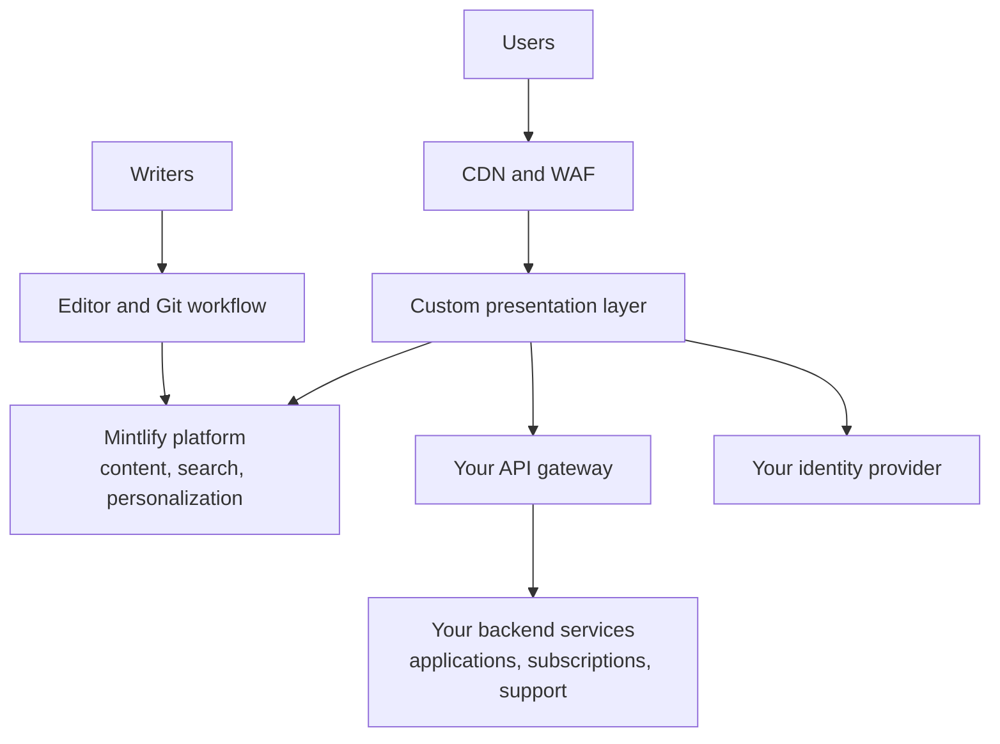

<Info>
  Les portails personnalisés nécessitent un [plan Enterprise](https://mintlify.com/pricing?ref=custom-portal) et un [déploiement auto-hébergé](/fr/deploy/self-host). Contactez votre équipe de compte pour en cadrer un.
</Info>

Pour certaines plateformes, la documentation n'est qu'une des surfaces d'un produit plus vaste — une place de marché d'API, un portail partenaire ou une expérience développeur intégrant la connexion, la gestion des identifiants et le support. Mintlify prend en charge ces cas d'usage en concevant, développant et maintenant une couche de présentation personnalisée qui remplace le front-end de votre portail existant, tandis que votre équipe rédige le contenu via l'éditeur Mintlify ou un workflow adossé à Git.

Le portail s'intègre à vos API, à votre passerelle et à vos systèmes en aval existants, qui restent détenus et exploités par votre équipe.

  ## Fonctionnalités

| Fonctionnalité | Ce qui est livré | Assuré par |
| --- | --- | --- |
| Couche de présentation personnalisée | Une application front-end complète dans votre design system, déployée à l'intérieur de votre environnement | Mintlify, aux côtés de la plateforme auto-hébergée |
| Pages produits et catalogue | Surfaces de place de marché, de découverte de produits et de documentation | Contenu maintenu sur Mintlify |
| Connexion | Sessions authentifiées sur l'ensemble du portail | Votre fournisseur d'identité |
| Applications et identifiants | Enregistrement d'applications et gestion des identifiants | Vos API backend |
| Abonnements | Abonnements aux produits et aux plans | Vos API backend |
| Profils et notifications | Profils utilisateur et centres de notifications | Vos API backend |
| Support | Création et suivi de tickets de support | Vos API backend |
| Recherche | Recherche tenant compte de la connexion et limitée à ce à quoi l'utilisateur a accès | Plateforme Mintlify |
| Contenu personnalisé | Filtrage par droits et par groupes appliqué côté serveur au moment du rendu, afin que les utilisateurs ne voient que les produits et pages auxquels ils ont accès | Plateforme Mintlify et votre fournisseur d'identité |
| Versions récurrentes | Versions numérotées avec des guides de mise à niveau, selon le même modèle opérationnel que tout [déploiement auto-hébergé](/fr/deploy/self-host#updates) | Mintlify |

  ## Workflow de rédaction

Le front-end personnalisé ne change pas la manière dont le contenu est rédigé. Entretenez le contenu avec l'éditeur ou un workflow local adossé à Git. Chaque modification passe par le processus de revue de votre dépôt avec une piste d'audit complète, et la publication déclenche des builds qui mettent à jour le portail automatiquement. Les changements de contenu ne nécessitent pas de déploiement du front-end.

  ## Architecture

La couche de présentation personnalisée s'intègre à la plateforme Mintlify auto-hébergée pour le contenu, la recherche et la personnalisation ; à votre passerelle API pour les applications, les abonnements et le support ; et à votre fournisseur d'identité pour l'authentification.

La couche de présentation personnalisée et la plateforme Mintlify s'exécutent à l'intérieur de votre périmètre réseau, en utilisant votre cluster, vos magasins de données et votre stack d'observabilité, sans sortie vers des tiers. Vos systèmes de référence en aval restent inchangés ; le portail y accède via vos API existantes.

  ## Comment se déroule l'engagement

<Steps>
  <Step title="Cadrage et conception">
    Votre équipe de compte cartographie les surfaces du portail, votre design system et les API backend que le portail consomme, puis convient d'un contrat d'intégration avec votre équipe plateforme.
  </Step>
  <Step title="Les surfaces publiques d'abord">
    L'engagement implémente typiquement votre design system et les surfaces de contenu publiques en premier, afin que vous puissiez valider l'expérience par rapport à votre portail existant avant la bascule.
  </Step>
  <Step title="Surfaces authentifiées">
    La connexion, la gestion des identifiants, les abonnements et les autres expériences authentifiées suivent, intégrées à votre fournisseur d'identité et à vos API backend.
  </Step>
  <Step title="Recherche, personnalisation et IA">
    La recherche tenant compte de la connexion et la personnalisation côté serveur complètent l'expérience de base. Les fonctionnalités d'IA optionnelles restent désactivées jusqu'à ce que votre équipe de sécurité ou de gouvernance de l'IA les approuve.
  </Step>
</Steps>

Tout au long, votre équipe examine les versions dans des environnements hors production et contrôle chaque bascule.

  ## Étapes suivantes

<Columns cols={2}>
  <Card title="Parlez à votre équipe de compte" icon="messages-square" href="https://www.mintlify.com/enterprise">
    Cadrez un engagement de portail personnalisé et planifiez votre lancement.
  </Card>
  <Card title="Auto-hébergement" icon="server" href="/fr/deploy/self-host">
    La base de déploiement sur laquelle s'exécute un portail personnalisé.
  </Card>
</Columns>
