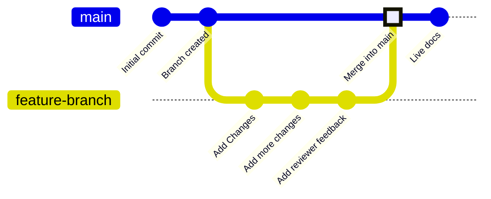

Les branches sont une fonctionnalité de gestion de versions qui pointent vers des commits spécifiques dans votre référentiel. Votre branche de déploiement, généralement appelée `main`, représente le contenu utilisé pour générer votre site de documentation en ligne. Toutes les autres branches sont indépendantes de votre documentation en ligne, sauf si vous choisissez de les fusionner dans votre branche de déploiement.

Les branches vous permettent de créer des instances distinctes de votre documentation pour apporter des modifications, obtenir des relectures et tester de nouvelles approches avant la publication. Votre équipe peut travailler sur des branches pour mettre à jour différentes parties de la documentation en parallèle, sans modifier ce que les utilisateurs voient sur votre site en ligne.

Le schéma suivant montre un exemple de workflow de branches où une branche de fonctionnalité est créée, des modifications sont apportées, puis la branche de fonctionnalité est fusionnée dans la branche principale.



Nous recommandons de toujours travailler à partir de branches lors de la mise à jour de la documentation afin de garder votre site en ligne stable et de permettre des workflows de relecture.


<div id="branch-naming-conventions">
  ## Conventions de nommage des branches
</div>

Utilisez des noms explicites et descriptifs qui indiquent clairement l’objectif de la branche.

**À utiliser** :

- `fix-broken-links`
- `add-webhooks-guide`
- `reorganize-getting-started`
- `ticket-123-oauth-guide`

**À éviter** :

- `temp`
- `my-branch`
- `updates`
- `branch1`

<div id="create-a-branch">
  ## Créer une branche
</div>

<Tabs>
  <Tab title="Avec l’éditeur web">
    1. Cliquez sur le nom de la branche dans la barre d’outils de l’éditeur.
    1. Cliquez sur **New Branch**.
    1. Saisissez un nom descriptif.
    1. Cliquez sur **Create Branch**.
  </Tab>

  <Tab title="Avec un environnement de développement local">
    <Steps>
      <Step title="Créer une branche depuis votre terminal">
        ```bash
        git checkout -b branch-name
        ```
        
        Cette commande crée la branche et bascule dessus en une seule fois.
      </Step>
      <Step title="Pousser la branche sur GitHub">
        ```bash
        git push -u origin branch-name
        ```

        L’option `-u` configure le suivi pour que les prochaines exécutions se fassent simplement avec `git push`.
      </Step>
    </Steps>
  </Tab>
</Tabs>

<div id="save-changes-on-a-branch">
  ## Enregistrer les modifications sur une branche
</div>

<Tabs>
  <Tab title="Avec l'éditeur web">
    Cliquez sur le bouton **Save as commit** dans le coin supérieur droit de la barre d'outils de l'éditeur. Cela crée un commit et envoie automatiquement votre travail sur votre branche.
  </Tab>

  <Tab title="Avec un environnement de développement local">
    Préparez, validez, puis poussez vos modifications.

    ```bash
    git add .
    git commit -m "Describe your changes"
    git push
    ```
  </Tab>
</Tabs>

<div id="switch-branches">
  ## Changer de branche
</div>

<Tabs>
  <Tab title="Utiliser l'éditeur web">
    1. Sélectionnez le nom de la branche dans la barre d’outils de l’éditeur.
    1. Sélectionnez la branche vers laquelle vous voulez passer dans le menu déroulant.

    <Warning>
      Les modifications non enregistrées seront perdues lors du changement de branche. Enregistrez d’abord votre travail.
    </Warning>
  </Tab>

  <Tab title="Utiliser le développement local">
    Passez à une branche existante :

    ```bash
    git checkout branch-name
    ```

    Ou créez une nouvelle branche et passez dessus en une seule commande :

    ```bash
    git checkout -b new-branch-name
    ```

  </Tab>
</Tabs>

<div id="merge-branches">
  ## Fusionner des branches
</div>

Une fois que vos modifications sont prêtes à être publiées, créez une pull request (demande de fusion) pour fusionner votre branche dans la branche de déploiement.