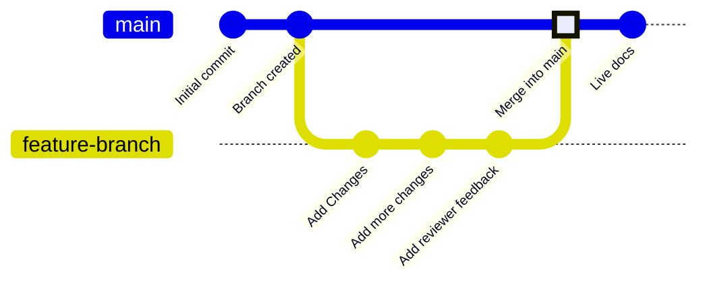

Les branches sont une fonctionnalité de gestion de versions qui pointent vers des commits spécifiques dans votre dépôt. Votre deployment branch, généralement appelée `main`, représente le contenu utilisé pour compiler votre site de documentation publié. Toutes les autres branches sont indépendantes de votre site publié, sauf si vous choisissez de les fusionner dans votre deployment branch.

Les branches vous permettent de créer des instances distinctes de votre documentation pour apporter des modifications, obtenir des révisions et tester de nouvelles approches avant la publication. Votre équipe peut travailler sur des branches pour mettre à jour différentes parties de la documentation en parallèle, sans modifier ce que les utilisateurs voient sur votre site publié.

Le schéma suivant montre un exemple de workflow de branches où vous créez une feature branch, apportez des modifications, puis fusionnez la feature branch dans la main branch.


```mermaid
gitGraph
    commit id: "Initial commit"
    commit id: "Branch created"
    branch feature-branch
    checkout feature-branch
    commit id: "Add Changes"
    commit id: "Add more changes"
    checkout main
    checkout feature-branch
    commit id: "Add reviewer feedback"
    checkout main
    merge feature-branch id: "Merge into main" type: HIGHLIGHT
    commit id: "Live docs"
```

Travaillez toujours à partir de branches lors de la mise à jour de la documentation afin de garder votre site publié stable et de permettre les workflows de révision.

<div id="branch-naming-conventions">

## Conventions de nommage des branches

</div>

Utilisez des noms explicites et descriptifs qui indiquent clairement l'objectif d'une branch.

**À utiliser** :

- `fix-broken-links`
- `add-webhooks-guide`
- `reorganize-getting-started`
- `ticket-123-oauth-guide`

**À éviter** :

- `temp`
- `my-branch`
- `updates`
- `branch1`

<div id="create-a-branch">

## Créer une branch

</div>

<Tabs>
  <Tab title="Avec l'éditeur web">
    1. Cliquez sur le nom de la branch dans la barre d'outils de l'éditeur. Si vous ne le voyez pas, [affichez le sélecteur de branch](/fr/editor/publish#show-the-branch-selector).
    1. Dans **Find a branch**, saisissez un titre descriptif. Si vous le laissez vide, l'éditeur nomme la branch d'après la date actuelle.
    1. Cliquez sur **New branch**.
    1. Si vous avez des modifications en attente, choisissez **Bring them to this branch** ou **Leave them behind**. Votre branch d'origine conserve ses modifications en attente dans les deux cas.
  </Tab>
  <Tab title="Avec le développement local">
    <Steps>
      <Step title="Créer une branch depuis votre terminal">
        ```bash
        git checkout -b branch-name
        ```

        Cette commande crée la branch et bascule dessus en une seule fois.
      </Step>
      <Step title="Pousser la branch sur GitHub">
        ```bash
        git push -u origin branch-name
        ```

        L'option `-u` configure le suivi pour que les prochains push se fassent simplement avec `git push`.
      </Step>
    </Steps>
  </Tab>
</Tabs>

<div id="save-changes-on-a-branch">

## Enregistrer les modifications sur une branch

</div>

<Tabs>
  <Tab title="Avec l'éditeur web">
    Vous n'avez pas besoin d'enregistrer manuellement. L'éditeur commit vos modifications sur la branch environ 15 secondes après que vous arrêtez d'écrire. Le premier commit ouvre une pull request vers votre deployment branch.
  </Tab>
  <Tab title="Avec le développement local">
    Préparez, commitez, puis poussez vos modifications.

    ```bash
    git add .
    git commit -m "Describe your changes"
    git push
    ```
  </Tab>
</Tabs>

<div id="switch-branches">

## Changer de branch

</div>

<Tabs>
  <Tab title="Avec l'éditeur web">
    1. Cliquez sur le nom de la branch dans la barre d'outils de l'éditeur pour ouvrir la liste déroulante des branches.
    1. Recherchez une branch par nom ou parcourez la liste.
    1. Cliquez sur la branch vers laquelle vous souhaitez basculer.

    Chaque branch dans la liste déroulante affiche un indicateur de pull request, ce qui vous permet de voir si la branch a une pull request ouverte, en brouillon, fusionnée ou fermée, ou aucune pull request pour le moment.

    Avant toute recherche, la liste déroulante répertorie les branches créées dans l'éditeur et les branches ayant une pull request ouverte ciblant votre deployment branch. La recherche par nom fait aussi remonter d'autres branches de votre dépôt, y compris les branches poussées directement via Git et les branches dont la pull request est fusionnée ou fermée. Consultez [Branch absente de la liste des branches de l'éditeur web](/fr/help-center/branch-missing-from-editor-branch-list).

    Vos modifications en attente restent sur la branch que vous quittez.
  </Tab>
  <Tab title="Avec le développement local">
    Passez à une branch existante :

    ```bash
    git checkout branch-name
    ```

    Ou créez une nouvelle branch et passez dessus en une seule commande :

    ```bash
    git checkout -b new-branch-name
    ```
  </Tab>
</Tabs>

<div id="merge-branches">

## Fusionner des branches

</div>

Une fois que vos modifications sont prêtes à être publiées, fusionnez votre branch dans la deployment branch.

<Tabs>
  <Tab title="Avec l'éditeur">
    Si Mintlify héberge votre dépôt et que votre branch ne requiert pas d'approbations, cliquez sur **Publish** dans la barre d'outils de l'éditeur, puis sur **Publish** pour fusionner votre branch et publier vos modifications.

    Sinon :

    1. Cliquez sur **Publish** dans la barre d'outils de l'éditeur, puis sur **Request review**. Cela marque la pull request de votre branch comme prête à être relue.
    1. Effectuez les révisions et vérifications requises.
    1. Cliquez sur **Publish**, puis sur **Merge and publish**.

    Consultez [Publier vos modifications](/fr/editor/publish) pour savoir comment les actions de publication disponibles changent en fonction de votre branch et des protections de branch.
  </Tab>
  <Tab title="Avec le développement local">
    Poussez votre branch, puis ouvrez une pull request dans votre fournisseur Git qui cible votre deployment branch. Une fois la pull request fusionnée, Mintlify compile et déploie vos modifications sur votre site publié.
  </Tab>
</Tabs>

<div id="delete-a-branch">

## Supprimer une branch

</div>

Supprimez les branches dont vous n'avez plus besoin afin de garder la liste déroulante des branches facile à gérer.

<Tabs>
  <Tab title="Avec l'éditeur web">
    1. Cliquez sur le nom de la branch dans la barre d'outils de l'éditeur pour ouvrir la liste déroulante des branches.
    1. Survolez la branch que vous souhaitez supprimer.
    1. Cliquez sur l'icône de corbeille **Delete branch**.
    1. Cliquez sur **Delete branch** pour confirmer.

    La suppression d'une branch ferme toute pull request ouverte pour cette branch et supprime la branch de votre dépôt. Vous ne pouvez pas supprimer votre deployment branch.
  </Tab>
  <Tab title="Avec le développement local">
    Supprimez la branch localement :

    ```bash
    git branch -d branch-name
    ```

    Puis supprimez-la de votre dépôt distant :

    ```bash
    git push origin --delete branch-name
    ```
  </Tab>
</Tabs>
