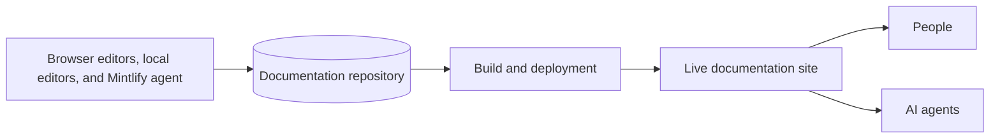

Mintlify transforme le contenu d'un référentiel Git en un site de documentation. Vous pouvez travailler depuis l'éditeur dans votre navigateur, votre environnement de développement local, ou en interrogeant l'agent Mintlify dans Slack. Ces trois workflows mettent à jour le même référentiel. Mintlify compile le contenu de votre référentiel en expériences optimisées pour les personnes et les agents.

  ## Organisations, déploiements et sites

Une **organisation** est l'espace de travail de votre équipe. Elle contient vos membres, les paramètres au niveau de l'organisation, et un ou plusieurs déploiements.

Un **déploiement** est un projet de documentation dans votre organisation. Il connecte un référentiel, un répertoire de contenu et une branche de déploiement à un site publié. Une organisation peut avoir plusieurs déploiements pour des produits distincts ou différentes propriétés de documentation.

Un **site en ligne** est le résultat publié d'un déploiement. Mintlify fournit par défaut une URL `.mintlify.site`. Vous pouvez connecter un [domaine personnalisé](/fr/customize/custom-domain) à votre site. Les sites incluent votre contenu, votre navigation, la recherche et toutes les fonctionnalités que vous activez, comme l'assistant ou le playground d'API.

<Note>
  La documentation utilise parfois **projet** comme nom générique pour un déploiement et son référentiel, sa configuration et son site associés.
</Note>

  ## Le référentiel est la source de vérité

Votre référentiel de documentation contient les fichiers qui définissent votre site. Mintlify lit ces fichiers à chaque build.

- Les **pages** sont des fichiers `.mdx`. Chaque page contient du contenu et des métadonnées de frontmatter.
- `docs.json` est le fichier de configuration obligatoire. Il contrôle la navigation, l'apparence, les intégrations, les paramètres d'API et d'autres comportements applicables à l'ensemble du site.
- Les **ressources** incluent les images, vidéos, polices et fichiers téléchargeables référencés par vos pages.
- Les **spécifications d'API** peuvent générer des pages de référence d'API et des playgrounds interactifs à partir de schémas OpenAPI, AsyncAPI ou GraphQL.
- Les **fichiers réutilisables** incluent les snippets et les composants React personnalisés que les pages peuvent importer.

Votre référentiel peut contenir des fichiers non publiés. Une page apparaît dans la navigation du site uniquement lorsque vous la référencez dans la navigation de votre [`docs.json`](/fr/organize/navigation), sinon elle est masquée. Les [pages masquées](/fr/organize/hidden-pages) ne sont accessibles que par un lien direct.

  ## Les pages et la navigation sont distinctes

Une **page** fournit le contenu à une URL. Son [frontmatter](/fr/organize/pages) contrôle les métadonnées et le comportement au niveau de la page, notamment son titre, sa description, son icône et sa mise en page.

La **navigation** détermine la façon dont les lecteurs se déplacent d'une page à l'autre. Configurez la navigation dans votre fichier `docs.json` en utilisant des éléments tels que les groupes, les onglets, les listes déroulantes, les produits, les versions et les langues. Le chemin du fichier identifie une page et sa position dans `docs.json` détermine son emplacement dans la navigation.

Cette séparation vous permet de réorganiser l'expérience du lecteur sans déplacer les fichiers. Elle vous permet également d'exclure les pages utilitaires de la navigation tout en les gardant accessibles par URL.

  ## L'édition et la publication sont des étapes distinctes

Vous pouvez modifier le même contenu via deux workflows principaux.

| Workflow | Où vous éditez | Comment les modifications parviennent à Git | Comment vous prévisualisez |
| --- | --- | --- | --- |
| Éditeur | Dashboard Mintlify dans votre navigateur | L'éditeur crée des commits et peut ouvrir des pull requests | Aperçu en direct dans l'éditeur |
| Développement local | Votre éditeur préféré | Vous validez et poussez avec Git | Commande CLI `mint dev` |

Dans l'éditeur, les modifications sont **enregistrées** automatiquement mais ne mettent pas immédiatement à jour votre référentiel ou votre site en ligne. Lorsque vous **publiez**, l'éditeur écrit les modifications dans Git. Ce qui se passe ensuite dépend de votre branche actuelle et des paramètres de protection de branche.

- Sur la **branche de déploiement**, la publication peut déclencher directement un build du site en ligne.
- Sur une **branche de fonctionnalité**, la publication peut enregistrer les modifications sur la branche ou créer une pull request pour relecture.
- Un **déploiement de prévisualisation** rend une pull request sur une URL temporaire afin que les relecteurs puissent inspecter le résultat avant la fusion.
- La fusion d'une pull request dans la branche de déploiement déclenche un déploiement en production.

Consultez [Branching et publication](/fr/editor/publish) pour le workflow complet.

  ## Un build transforme les fichiers source en expériences pour les lecteurs

Lorsque le contenu atteint la branche de déploiement, Mintlify valide le projet, rend les pages et déploie le site. Le même contenu source prend en charge plusieurs manières de trouver et de consommer l'information :

- Le site de documentation affiche les pages pour les personnes sur ordinateur et mobile.
- La recherche indexe le site afin que les lecteurs puissent trouver les pages pertinentes.
- L'assistant répond aux questions à partir de la documentation et cite ses sources.
- Les versions Markdown des pages, `llms.txt` et `skill.md` aident les outils d'IA à comprendre le contenu.
- Un serveur MCP public permet aux outils d'IA compatibles de récupérer la documentation sous forme de contexte structuré.

Exécutez [`mint validate`](/fr/cli/commands#mint-validate) et [`mint broken-links`](/fr/cli/commands#mint-broken-links) avant de publier pour détecter les problèmes courants en local.

  ## Les fonctionnalités d'IA de Mintlify ont des rôles différents

Mintlify propose des fonctionnalités d'IA distinctes pour la lecture, l'écriture, l'automatisation et l'accès aux outils externes.

| Fonctionnalité | Utilisée par | Objectif | Modifie le contenu |
| --- | --- | --- | --- |
| [Assistant](/fr/assistant) | Lecteurs de la documentation | Répond aux questions à partir de votre contenu | Non |
| [Agent](/fr/agent) | Mainteneurs de la documentation | Recherche et propose des mises à jour de contenu ou de configuration | Oui |
| [Automatisations](/fr/automations/index) | Mainteneurs de la documentation | Exécute l'agent selon un planning, une mise à jour du référentiel ou un événement d'intégration | Oui |
| [Serveur MCP de recherche](/fr/ai/model-context-protocol) | Agents | Récupère le contexte à partir d'un site de documentation publié | Non |
| [Serveur MCP admin](/fr/ai/mintlify-mcp) | Agents | Lit et met à jour les déploiements via des outils authentifiés | Oui |
| [Mintlify Index](/fr/search-index) | Agents | Récupère le contexte technique actuel sur tous les sites publics Mintlify et sur le web | Non |

  ## Apprenez la terminologie

Consultez le [glossaire](/fr/reference/glossary) pour les définitions des termes Mintlify, Git, de publication, de navigation, d'API et d'IA utilisés dans l'ensemble de la documentation.
