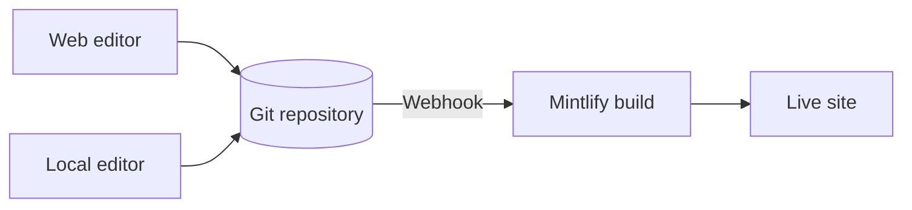

Mintlify héberge votre contenu sous forme de site web. Votre contenu réside dans un dépôt Git sous forme de fichiers MDX, et Mintlify construit et déploie automatiquement votre site lorsque vous poussez une modification.

  ## Les trois parties d'un projet Mintlify

**Votre dépôt** est la source de vérité pour votre documentation. Il contient un fichier MDX pour chaque page et un fichier `docs.json` qui configure la navigation, le thème et les paramètres de votre site. Vous pouvez utiliser votre propre dépôt GitHub ou GitLab, ou laisser Mintlify en créer un pour vous lors de l'intégration.

**Le tableau de bord Mintlify** se connecte à votre dépôt et vous permet de gérer votre site. Utilisez-le pour surveiller les déploiements, configurer les paramètres, gérer votre équipe et modifier le contenu directement dans le navigateur.

**Votre site** propulsé par Mintlify. Mintlify construit votre site à partir de votre dépôt et le déploie sur une URL `.mintlify.app` par défaut. Quand vous êtes prêt, vous pouvez pointer un domaine personnalisé vers votre site.

  ## Modification du contenu

Il existe deux façons de modifier votre contenu, et vous pouvez passer de l'une à l'autre librement.

- **Éditeur web** : Modifiez et publiez des pages dans votre navigateur. L'éditeur envoie automatiquement les modifications vers votre dépôt Git.
- **CLI et éditeur local** : Clonez votre dépôt, exécutez `mint dev` pour prévisualiser votre site localement, puis poussez les modifications pour déployer.

Plusieurs membres de l'équipe peuvent travailler dans l'un ou l'autre flux de travail en même temps, en utilisant des branches Git pour gérer les modifications en parallèle. Toute personne pouvant pousser vers votre dépôt peut mettre à jour votre contenu.

  ## Fonctionnalités IA

Les fonctionnalités IA intégrées aident les personnes et l'IA à trouver et comprendre votre contenu, et vous aident à maintenir votre contenu.

L'**assistant** permet à vos utilisateurs de poser des questions et d'obtenir des réponses citées à partir de votre contenu.

L'**agent** aide votre équipe à créer et maintenir du contenu en générant des mises à jour à partir de workflows planifiés, de pull requests fusionnées dans votre dépôt de fonctionnalités, ou de fils Slack.

Consultez [Documentation native IA](/fr/ai-native) pour un aperçu de toutes les fonctionnalités IA.

  ## Prochaines étapes

<Card title="Démarrage rapide" icon="rocket" horizontal href="/fr/quickstart">
  Déployez votre premier site de documentation en quelques minutes.
</Card>
