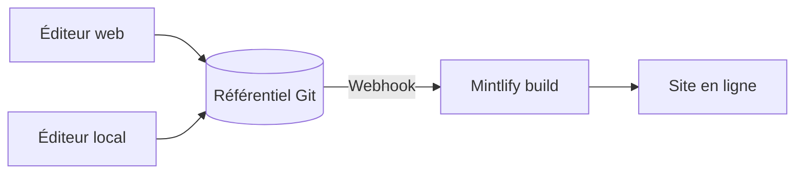

Mintlify héberge votre contenu sous la forme d’un site web. Votre contenu se trouve dans un référentiel Git sous forme de fichiers MDX, et Mintlify génère et déploie automatiquement votre site lorsque vous effectuez un push.

  ## Les trois parties d’un projet Mintlify

**Votre référentiel** est la source de vérité pour votre documentation. Il contient un fichier MDX pour chaque page et un fichier `docs.json` qui configure la navigation, le thème et les paramètres de votre site. Vous pouvez utiliser votre propre référentiel GitHub ou GitLab, ou laisser Mintlify en créer un pour vous lors de la configuration initiale.

**Le Tableau de bord Mintlify** se connecte à votre référentiel et vous permet de gérer votre site. Utilisez-le pour surveiller les déploiements, configurer les paramètres, gérer votre équipe et modifier le contenu directement dans le navigateur.

**Votre site**, propulsé par Mintlify. Mintlify génère votre site à partir de votre référentiel et le déploie par défaut sous une URL en `.mintlify.app`. Lorsque vous êtes prêt, vous pouvez associer un domaine personnalisé à votre site.

  ## Modification du contenu

Il existe deux façons de modifier votre contenu, et vous pouvez passer librement de l’une à l’autre.

* **Éditeur web** : modifiez et publiez des pages dans votre navigateur. L’éditeur enregistre automatiquement les modifications dans votre référentiel Git via des commits.
* **CLI et éditeur local** : clonez votre référentiel, exécutez `mint dev` pour prévisualiser votre site en local, puis poussez les modifications pour déployer.

Plusieurs membres de l’équipe peuvent utiliser l’un ou l’autre de ces modes de travail en parallèle, en s’appuyant sur des branches Git pour gérer les modifications simultanées. Toute personne pouvant pousser vers votre référentiel peut mettre à jour votre contenu.

  ## Fonctionnalités d’IA

Les fonctionnalités d’IA intégrées aident les personnes et les systèmes d’IA à trouver et à comprendre votre contenu, et vous aident à le maintenir à jour.

L’**Assistant** permet à vos utilisateurs de poser des questions et d’obtenir des réponses sourcées à partir de votre contenu.

L’**agent** aide votre équipe à créer et à maintenir le contenu en générant des mises à jour à partir de workflows planifiés, de pull requests (demandes de fusion) fusionnées dans votre référentiel de fonctionnalités, ou de fils de discussion Slack.

Consultez la section [Documentation native à l’IA](/fr/ai-native) pour une vue d’ensemble de toutes les fonctionnalités d’IA.

  ## Prochaines étapes

<Card title="Démarrage rapide" icon="rocket" horizontal href="/fr/quickstart">
  Déployez votre premier site de documentation en quelques minutes.
</Card>