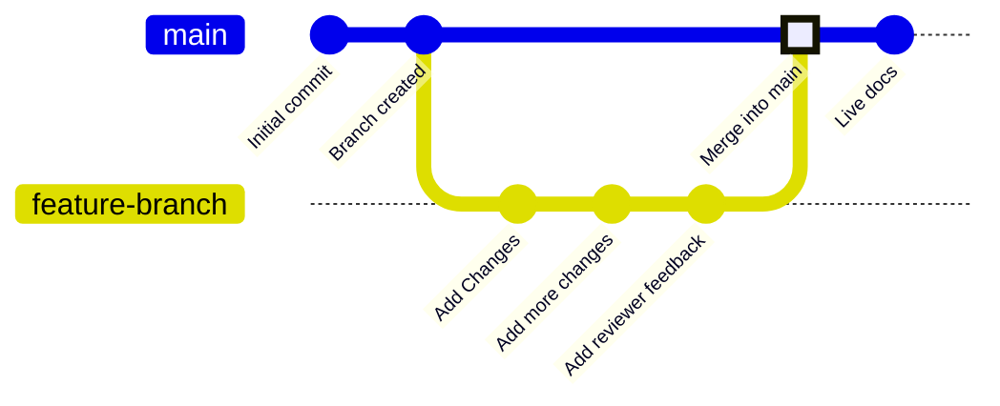

Branches are a feature of version control that point to specific commits in your repository. Your deployment branch, usually called `main`, represents the content used to build your live documentation site. All other branches are independent of your live docs unless you choose to merge them into your deployment branch.

Branches let you create separate instances of your documentation to make changes, get reviews, and try new approaches before publishing. Your team can work on branches to update different parts of your documentation simultaneously without affecting what users see on your live site.

The following diagram shows an example of a branch workflow where a feature branch is created, changes are made, and then the feature branch is merged into the main branch.



We recommend always working from branches when updating documentation to keep your live site stable and enable review workflows.

## Branch naming conventions

Use clear, descriptive names that explain the purpose of a branch.

**Use**:
- `fix-broken-links`
- `add-webhooks-guide`
- `reorganize-getting-started`
- `ticket-123-oauth-guide`

**Avoid**:
- `temp`
- `my-branch`
- `updates`
- `branch1`

## Create a branch

<Tabs>
  <Tab title="Using web editor">
    1. Click the branch name in the editor toolbar.
    1. Click **New Branch**.
    1. Enter a descriptive name.
    1. Click **Create Branch**.
  </Tab>

  <Tab title="Using local development">
    <Steps>
      <Step title="Create a branch from your terminal">
        ```bash
        git checkout -b branch-name
        ```
        
        This creates the branch and switches to it in one command.
      </Step>
      <Step title="Push the branch to GitHub">
        ```bash
        git push -u origin branch-name
        ```

        The `-u` flag sets up tracking so future pushes just need `git push`.
      </Step>
    </Steps>
  </Tab>
</Tabs>

## Save changes on a branch

<Tabs>
  <Tab title="Using web editor">
    Select the **Save as commit** button in the top-right of the editor toolbar. This creates a commit and pushes your work to your branch automatically.
  </Tab>

  <Tab title="Using local development">
    Stage, commit, and push your changes.

    ```bash
    git add .
    git commit -m "Describe your changes"
    git push
    ```
  </Tab>
</Tabs>

## Switch branches

<Tabs>
  <Tab title="Using web editor">
    1. Select the branch name in the editor toolbar.
    1. Select the branch you want to switch to from the dropdown menu.

    <Warning>
      Unsaved changes are lost when switching branches. Save your work first.
    </Warning>
  </Tab>

  <Tab title="Using local development">
    Switch to an existing branch:

    ```bash
    git checkout branch-name
    ```

    Or create and switch in one command:

    ```bash
    git checkout -b new-branch-name
    ```

  </Tab>
</Tabs>

## Merge branches

Once your changes are ready to publish, create a pull request to merge your branch into the deployment branch.
