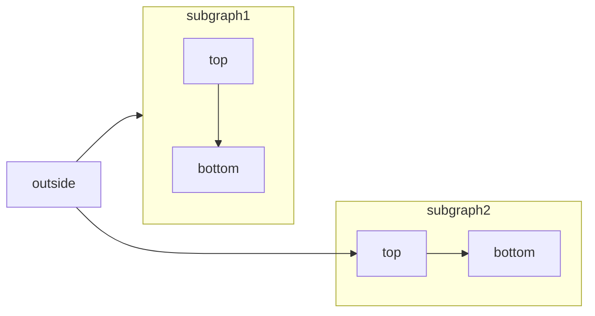

<RequestExample>
  ````md Mermaid Flowchart Example
  ```mermaid
    flowchart LR
      subgraph subgraph1
          direction TB
          top1[top] --> bottom1[bottom]
      end
      subgraph subgraph2
          direction TB
          top2[top] --> bottom2[bottom]
      end
      %% ^ These subgraphs are identical, except for the links to them:

      %% Link *to* subgraph1: subgraph1 direction is maintained
      outside --> subgraph1
      %% Link *within* subgraph2:
      %% subgraph2 inherits the direction of the top-level graph (LR)
      outside ---> top2
  ```
  ````
</RequestExample>

[Mermaid](https://mermaid.js.org/)memungkinkan Anda membuat diagram visual menggunakan teks dan kode.



Anda dapat membuat hal-hal berikut menggunakan diagram Mermaid:

* Diagram Alur
* Diagram Urutan
* Diagram Kelas
* Diagram Status
* Diagram Hubungan Entitas
* Perjalanan Pengguna
* dan lainnya

Untuk daftar lengkap diagram yang didukung oleh Mermaid, kunjungi[situs web mereka](https://mermaid.js.org/).

## Sintaks untuk diagram Mermaid

Untuk membuat diagram alur, Anda dapat menulis diagram alur Mermaid di dalam blok kode Mermaid.

````md
```mermaid
// Your mermaid code block here
```
````
