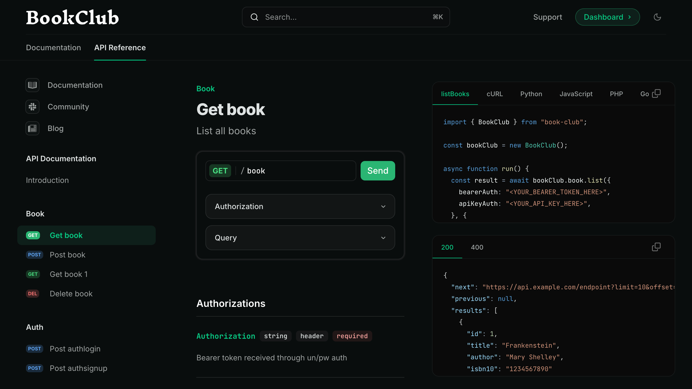
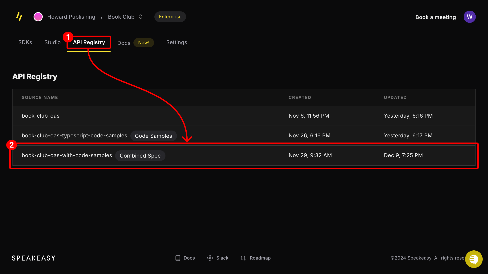
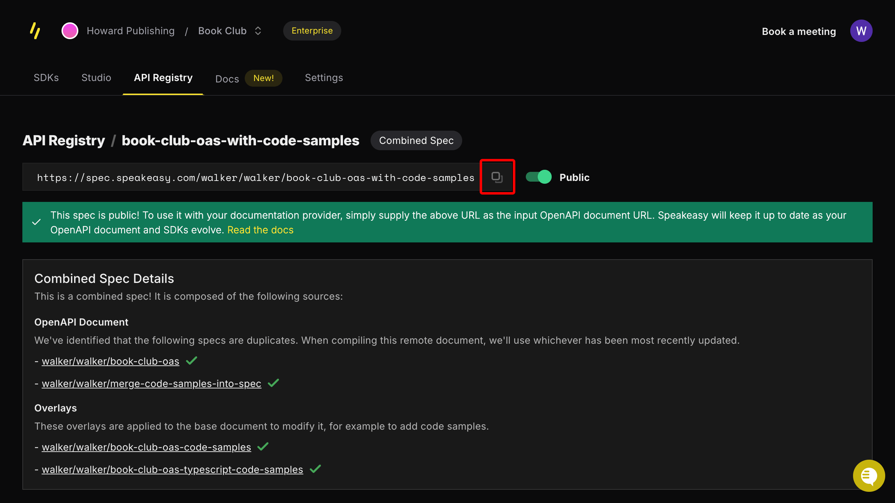

Autogenerated code snippets from Speakeasy SDKs can be integrated directly into Mintlify API reference documentation. SDK usage snippets are shown in the [interactive playground](https://mintlify.com/docs/api-playground/overview) of Mintlify-powered documentation sites.



## Prerequisites

To integrate Mintlify with Speakeasy, you'll need the following:

  - A [Mintlify documentation repository](https://mintlify.com/docs/quickstart#creating-the-repository).
  - A Speakeasy-generated SDK with a configured [automated code sample URL](https://www.speakeasy.com/docs/code-samples/automated-code-sample-urls).

## Setting up the integration

### Get the API's combined spec public URL from the registry

Navigate to the [Speakeasy Dashboard](https://app.speakeasy.com) and open the **API Registry** tab. Open the `*-with-code-samples` entry for the API.



> NOTE: If the entry is not labeled **Combined Spec**, ensure that the API
> has an [automatic code sample
> URL](https://www.speakeasy.com/docs/code-samples/automated-code-sample-urls) configured.

From the registry entry's page, copy the provided public URL.



### Update the `mint.json` configuration file 

Add the combined spec URL to **Anchors** or **Tabs** in the `mint.json` file of a Mintlify repository. Anchors are displayed as a list of links on the left side of the documentation, while Tabs are displayed as tabs along the top of the documentation.

Add the combined spec URL to **Anchors** by updating the `anchor` field in the `mint.json` file as follows:

```json mint.json
{
  "anchors": [
    {
      "name": "API Reference",
      // !mark
      "openapi": "SPEAKEASY_COMBINED_SPEC_URL",
      "url": "api-reference",
      "icon": "square-terminal"
    }
  ]
}
```

Add the combined spec URL to **Tabs** by updating the `tab` field in the `mint.json` file as follows:

```json mint.json
{
  "tabs": [
    {
      "name": "API Reference",
      "url": "api-reference",
      // !mark
      "openapi": "SPEAKEASY_COMBINED_SPEC_URL"
    }
  ]
}
```

Speakeasy-generated code snippets can now be viewed in the Mintlify API reference documentation. See the code snippets in action in the [interactive playground](https://mintlify.com/docs/api-playground/overview) of the Mintlify-powered documentation site.

## Next steps

Mintlify offers flexible customization options for API references generated from OpenAPI documents. For more information, refer to the [Mintlify documentation](https://mintlify.com/docs/api-playground/openapi/setup).

