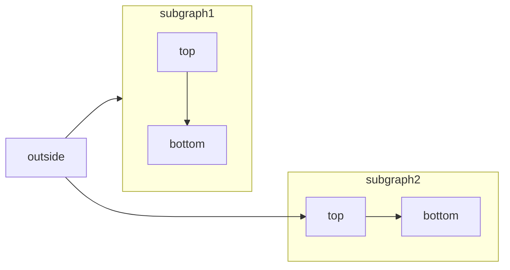

[Mermaid](https://mermaid.js.org/) lets you create visual diagrams using text and code.

You can create the following using Mermaid diagrams:

- Flowchart
- Sequence diagram
- Class diagram
- State diagram
- Entity relationship diagram
- User journey
- and more

For a complete list of diagrams supported by Mermaid, check out their [website](https://mermaid.js.org/).

## Syntax for Mermaid diagrams

To create a flowchart, you can write the Mermaid flowchart inside a Mermaid code block.

````md
```mermaid
// Your mermaid code block here
```
````

For example, the following code will render a Flowchart Mermaid diagram.

````md

````


We support all the diagram syntaxes from [Mermaid](https://mermaid.js.org/).
