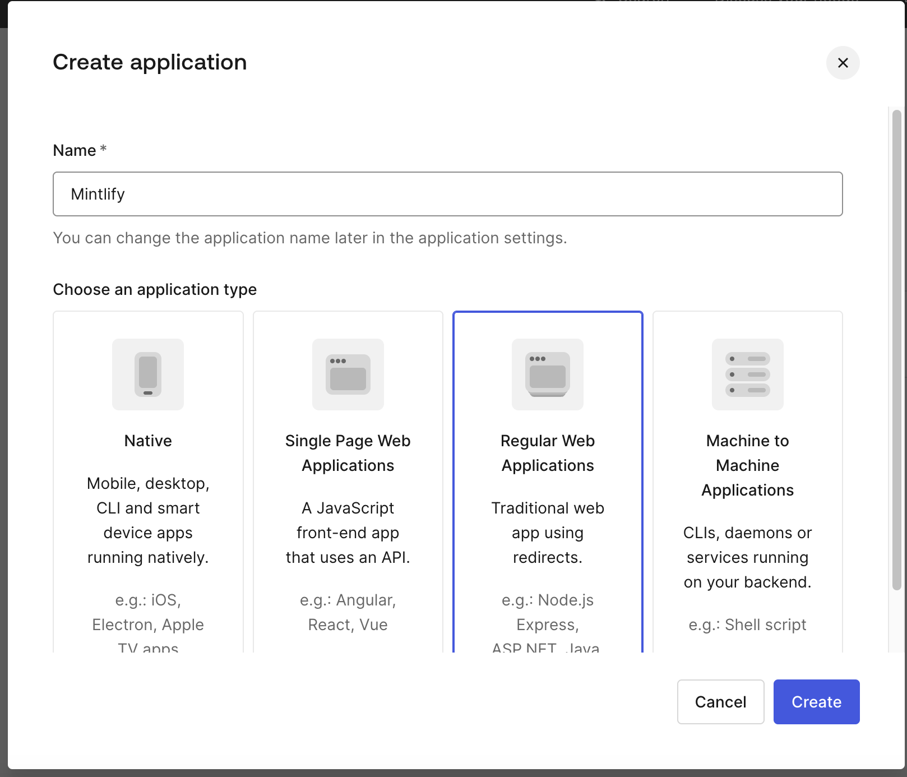

<Frame>
  

  
</Frame>

## Getting Started

Welcome to Repacket - we make browsing the internet secure by default for companies.

Repacket is able to analyze your web traffic, and prevent threats like phishing, malware, and data loss risks.&#x20;

This guide will walk you through a quick install and login to the Repacket dashboard.

### Setup

<Steps>
  <Step title="Install our desktop app">
    <CardGroup cols={2}>
      <Card title="Windows Download" icon="windows" href="https://repacket-installers.s3.us-east-1.amazonaws.com/Repacket+Installer.exe" />

      <Card title="MacOS Download" icon="apple" href="https://repacket-installers.s3.us-east-1.amazonaws.com/Repacket+Installer.pkg" />
    </CardGroup>
  </Step>

  <Step title="Enter your tenant ID">
    During setup, you will be asked for a tenant ID.

    

    Today, this is the URL of your Repacket instance.
  </Step>

  <Step title="Login to Repacket">
    When you browse to any web page, you will be asked to login to Repacket.

    

    
  </Step>
</Steps>

### Done!

Congrats, and welcome to Repacket!

Feel free to continue and tailor your instance!

Here's a few of the best places to start:

* [Phishing Prevention](/modules/phishing-prevention)

* [Data Loss Prevention (DLP)](/modules/dlp)

* [Content Filtering](/modules/content-filtering)