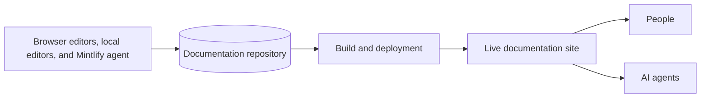

Mintlify turns content in a Git repository into a documentation site. You can work from the editor in your browser, your local development environment, or prompt the Mintlify agent in Slack. All three workflows update the same repository. Mintlify builds your repository content into optimized experiences for people and agents.

## Organizations, deployments, and sites

An **organization** is the workspace for your team. It contains your members, organization-level settings, and one or more deployments.

A **deployment** is a documentation project in your organization. It connects a repository, content directory, and deployment branch to a published site. An organization can have multiple deployments for separate products or documentation properties.

A **live site** is the published output of a deployment. Mintlify provides a `.mintlify.site` URL by default. You can connect a [custom domain](/customize/custom-domain) for your site. Sites include your content, navigation, search, and any features you enable, such as the assistant or API playground.

<Note>
  The documentation sometimes uses **project** as a general name for a deployment and its connected repository, configuration, and site.
</Note>

## The repository is the source of truth

Your documentation repository contains the files that define your site. Mintlify reads these files during every build.

- **Pages** are `.mdx` files. Each page contains content and frontmatter metadata.
- `docs.json` is the required configuration file. It controls navigation, appearance, integrations, API settings, and other site-wide behavior.
- **Assets** include images, videos, fonts, and downloadable files referenced by your pages.
- **API specifications** can generate API reference pages and interactive playgrounds from OpenAPI, AsyncAPI, or GraphQL schemas.
- **Reusable files** include snippets and custom React components that pages can import.

Your repository can contain unpublished files. A page appears in the site navigation only when you reference it in your [`docs.json`](/organize/navigation) navigation; otherwise it is hidden. [Hidden pages](/organize/hidden-pages) are reachable only by a direct link.

## Pages and navigation are separate

A **page** supplies the content at a URL. Its [frontmatter](/organize/pages) controls page-level metadata and behavior, including its title, description, icon, and layout.

**Navigation** determines how readers move through pages. Configure navigation in your `docs.json` file using elements such as groups, tabs, dropdowns, products, versions, and languages. The file path identifies a page and its position in `docs.json` determines where it appears in the navigation.

This separation lets you reorganize the reader experience without moving files. It also lets you exclude utility pages from the navigation while keeping them available by URL.

## Editing and publishing are different stages

You can edit the same content through two primary workflows.

| Workflow | Where you edit | How changes reach Git | How you preview |
| --- | --- | --- | --- |
| Editor | Mintlify dashboard in your browser | The editor creates commits and can open pull requests | Live preview in the editor |
| Local development | Your preferred editor | You commit and push with Git | `mint dev` CLI command |

In the editor, changes **save** automatically but do not immediately update your repository or live site. When you **publish**, the editor writes the changes to Git. What happens next depends on your current branch and branch protection settings.

- On the **deployment branch**, publishing can trigger a build of the live site directly.
- On a **feature branch**, publishing can save changes to the branch or create a pull request for review.
- A **preview deployment** renders a pull request at a temporary URL so reviewers can inspect the result before merging.
- Merging a pull request into the deployment branch triggers a production deployment.

See [Branching and publishing](/editor/branching-and-publishing) for the complete workflow.

## A build turns source files into reader experiences

When content reaches the deployment branch, Mintlify validates the project, renders the pages, and deploys the site. The same source content supports several ways of finding and consuming information:

- The documentation site renders pages for people on desktop and mobile.
- Search indexes the site so readers can find relevant pages.
- The assistant answers questions from the documentation and cites its sources.
- Markdown versions of pages, `llms.txt`, and `skill.md` help AI tools understand the content.
- A public MCP server lets compatible AI tools retrieve documentation as structured context.

Run [`mint validate`](/cli/commands#mint-validate) and [`mint broken-links`](/cli/commands#mint-broken-links) before publishing to catch common problems locally.

## Mintlify's AI features have different roles

Mintlify provides separate AI features for reading, writing, automation, and external tool access.

| Feature | Used by | Purpose | Changes content |
| --- | --- | --- | --- |
| [Assistant](/assistant) | Documentation readers | Answers questions from your content | No |
| [Agent](/agent) | Documentation maintainers | Researches and proposes content or configuration updates | Yes |
| [Automations](/automations/index) | Documentation maintainers | Runs the agent from a schedule, repository update, or integration event | Yes |
| [Search MCP server](/ai/model-context-protocol) | Agents | Retrieves context from one published documentation site | No |
| [Admin MCP server](/ai/mintlify-mcp) | Agents | Reads and updates deployments through authenticated tools | Yes |
| [Mintlify Index](/search-index) | Agents | Retrieves current technical context across all public Mintlify sites and the web | No |

## Learn the terminology

See the [glossary](/reference/glossary) for definitions of Mintlify, Git, publishing, navigation, API, and AI terms used throughout the documentation.
