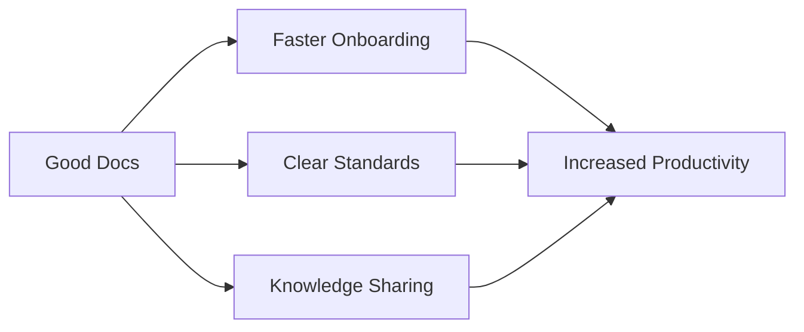

# Why Documentation is Cool

Documentation isn't just a necessary evil - it's a powerful tool that can transform your project, delight your users, and build thriving communities. Let's explore why documentation deserves more love and attention.

## Supercharging User Experience 🚀

<Tip>
Well-crafted documentation can reduce user frustration by up to 90% and dramatically increase product adoption rates.
</Tip>

Great documentation:
- Helps users get started quickly
- Provides clear pathways to advanced features
- Answers questions before they're asked
- Builds user confidence and competence

## Accelerating Development ⚡

Documentation supercharges development by:
- Reducing onboarding time for new team members
- Preserving critical knowledge and decision rationale
- Setting clear standards and best practices
- Enabling asynchronous collaboration

## Lightening Support Burden 🎯

<CardGroup>
  <Card title="Reduced Support Tickets" icon="ticket">
    Good documentation can reduce support tickets by up to 60%
  </Card>
  <Card title="Faster Resolution Times" icon="clock">
    Documentation helps support teams resolve issues more quickly
  </Card>
</CardGroup>

When documentation is thorough and accessible:
- Users can self-serve answers to common questions
- Support teams can reference standardized solutions
- Complex issues are easier to diagnose and resolve
- Knowledge base becomes a valuable support asset

## Building Community 🌟

Documentation plays a vital role in building and nurturing communities by:
- Creating a shared understanding
- Enabling contribution from new members
- Establishing project culture and values
- Facilitating knowledge exchange

<Frame>
  
</Frame>

## Best Practices for Cool Docs

1. **Keep it Fresh**
   - Regular updates maintain relevance
   - Version control ensures accuracy
   - User feedback drives improvements

2. **Make it Accessible**
   - Clear navigation
   - Searchable content
   - Multiple learning styles (text, diagrams, examples)

3. **Show, Don't Just Tell**
   - Code examples
   - Interactive tutorials
   - Visual guides

<Warning>
Remember: The best documentation is the one that gets read and used. Focus on clarity, accessibility, and user needs.
</Warning>

## Documentation ROI

Good documentation delivers measurable returns:
- Reduced support costs
- Faster development cycles
- Improved user satisfaction
- Increased product adoption
- Stronger community engagement

## Getting Started

Ready to make your documentation cool? Start with:
1. Audit your current documentation
2. Identify key user needs
3. Create a documentation strategy
4. Implement modern documentation tools
5. Gather and act on feedback

<Check>
Documentation isn't just about writing - it's about empowering users, supporting growth, and building lasting value for your project.
</Check>

## Resources

Want to learn more about creating awesome documentation? Check out these resources:
- [Documentation Best Practices Guide](/docs/best-practices)
- [Tool Recommendations](/docs/tools)
- [Community Guidelines](/docs/community)