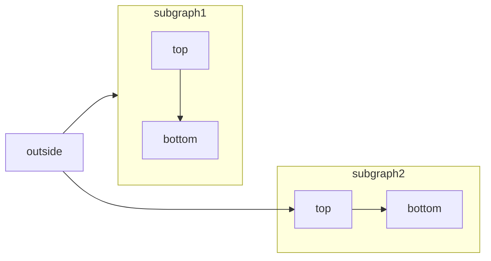
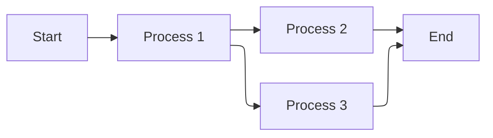
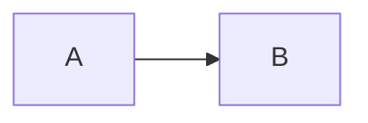

[Mermaid](https://mermaid.js.org/) 支持使用文本与代码构建流程图、时序图、甘特图及其他各类图表。

有关支持的图表类型与语法的完整列表，请参阅 [Mermaid 文档](https://mermaid.js.org/intro/)。



````mdx Mermaid flowchart example

````

<div id="elk-layout-support">
  ## ELK 布局支持
</div>

Mintlify 支持将 [ELK (Eclipse Layout Kernel)](https://www.eclipse.org/elk/) 布局引擎用于 Mermaid 图表。ELK 能够优化元素排列以减少重叠并提高可读性，这对于大型或复杂的图表尤其有用。

要在 Mermaid 图表中使用 ELK 布局，请在图表开头添加 `%%{init: {'flowchart': {'defaultRenderer': 'elk'}}}%%` 指令：

````mdx ELK layout example

````

<div id="interactive-controls">
  ## 交互式控件
</div>

所有 Mermaid 图表都包含交互式缩放和平移控件。默认情况下，当图表 height 超过 120px 时会显示这些控件。

- **放大/缩小**：使用缩放按钮来放大或缩小图表。
- **平移**：使用方向箭头在图表中移动视图。
- **重置视图**：点击重置按钮返回到初始视图。

在处理无法完全显示在视口中的大型或复杂图表时，这些控件尤其有用。

<div id="properties">
  ## 属性
</div>

<ResponseField name="actions" type="boolean">
  显示或隐藏交互控件。设置该属性后会覆盖默认行为（当图表的 height 超过 120px 时显示控件）。
</ResponseField>

<ResponseField name="placement" type="string" default="bottom-right">
  交互控件的位置。可选值：`top-left`、`top-right`、`bottom-left`、`bottom-right`。
</ResponseField>

<div id="examples">
  ### 示例
</div>

在示意图中隐藏控件：

````mdx

````

将控件显示在左上角：

````mdx

````

同时使用这两个属性：

````mdx

````


<div id="syntax">
  ## 语法
</div>

要创建 Mermaid 图表，请将图表定义写入 Mermaid 代码块中。

````mdx
```mermaid
// 在此处编写您的 mermaid 图表代码
```
````
