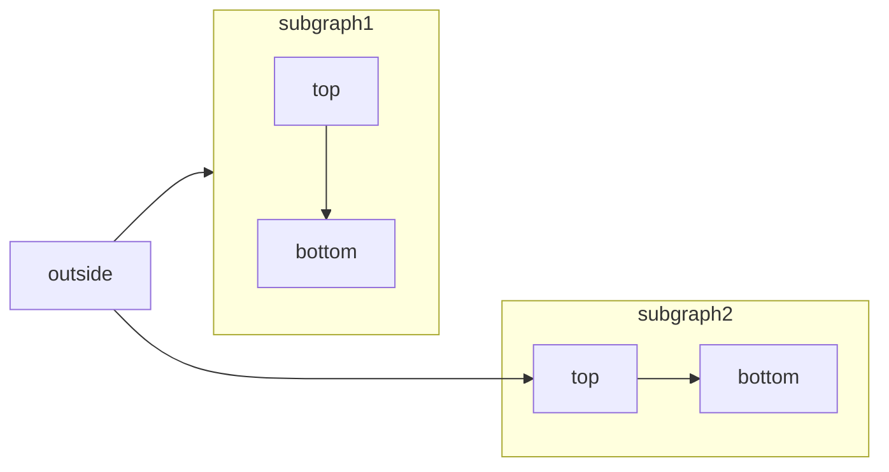

[Mermaid](https://mermaid.js.org/) 让你使用文本和代码构建流程图、时序图、甘特图等各类图表。

有关受支持的图表类型与语法的完整列表，请参阅 [Mermaid 文档](https://mermaid.js.org/intro/)。

<RequestExample>

````mdx Mermaid flowchart example

````

</RequestExample>


## 语法

要创建 Mermaid 图表，请将图表定义写入一个 Mermaid 代码块中。

````mdx
```mermaid
// 在此处编写你的 Mermaid 图表代码
```
````
