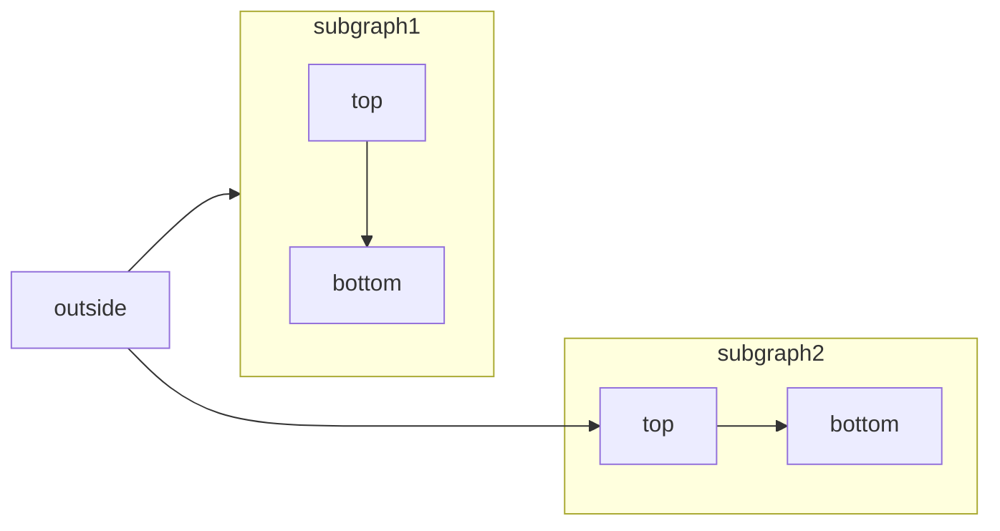

[Mermaid](https://mermaid.js.org/) 可通过文本与代码构建流程图、时序图、甘特图等各类图表。

有关支持的图表类型与语法的完整列表，请参阅 [Mermaid 文档](https://mermaid.js.org/intro/)。



````mdx Mermaid 流程图示例

````

<div id="syntax">
  ## 语法
</div>

要创建 Mermaid 图表，请将图表定义写在 Mermaid 代码块中。

````mdx
```mermaid
// 在此编写你的 Mermaid 图表代码
```
````