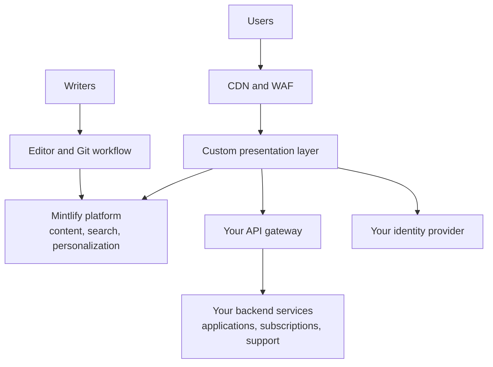

<Info>
  定制门户需要 [Enterprise 套餐](https://mintlify.com/pricing?ref=custom-portal)以及[自托管部署](/zh/deploy/self-host)。请联系你的客户团队来规划部署范围。
</Info>

对某些平台而言，文档只是一个更大产品的一个表层——一个 API 市场、一个合作伙伴门户，或是一个内建了登录、凭据和支持的开发者体验。Mintlify 支持这些用例：由我们设计、构建并持续维护一个定制的呈现层来替换你现有的门户前端，同时你的团队通过 Mintlify 编辑器或基于 Git 的工作流来创作内容。

该门户会与你现有的 API、网关和下游系统集成，这些系统仍由你的团队拥有和运营。

  ## 功能

| 功能 | 交付内容 | 支撑方 |
| --- | --- | --- |
| 定制呈现层 | 采用你的设计体系的完整前端应用，部署在你的环境中 | Mintlify，与自托管平台一同交付 |
| 产品与目录页面 | 市场、产品发现和文档界面 | 内容维护在 Mintlify 上 |
| 登录 | 门户内的认证会话 | 你的身份提供方 |
| 应用与凭据 | 应用注册和凭据管理 | 你的后端 API |
| 订阅 | 产品与套餐订阅 | 你的后端 API |
| 个人资料与通知 | 用户资料与通知中心 | 你的后端 API |
| 支持 | 支持工单的创建和跟踪 | 你的后端 API |
| 搜索 | 感知登录状态、限定在用户可访问范围内的搜索 | Mintlify 平台 |
| 个性化内容 | 在渲染时基于权限和分组在服务器端进行过滤，用户只会看到他们有权访问的产品和页面 | Mintlify 平台和你的身份提供方 |
| 持续发布 | 带升级指南的版本化发布，与任意[自托管部署](/zh/deploy/self-host#updates)相同的运营模式 | Mintlify |

  ## 创作流程

定制前端不会影响内容的创作方式。你可以通过编辑器或本地基于 Git 的工作流来维护内容。每次变更都会经过你仓库的评审流程，具备完整的审计记录；发布会触发构建自动更新门户。内容变更不需要重新部署前端。

  ## 架构

定制呈现层与自托管的 Mintlify 平台集成以获取内容、搜索和个性化能力；与你的 API 网关集成以处理应用、订阅和支持；并与你的身份提供方集成以完成认证。

定制呈现层与 Mintlify 平台都运行在你的网络边界内，使用你的集群、数据存储和可观测性技术栈，没有任何向第三方的外发流量。你的下游记录系统保持不变；门户通过你现有的 API 访问它们。

  ## 项目如何推进

<Steps>
  <Step title="确定范围与设计">
    你的客户团队会梳理门户的各个界面、你的设计体系以及门户所调用的后端 API，并与你的平台团队约定集成契约。
  </Step>
  <Step title="优先交付公开界面">
    项目通常会先落地你的设计体系和公开的内容界面，让你在切换前可以对照现有门户来验证体验。
  </Step>
  <Step title="认证后的界面">
    随后交付登录、凭据管理、订阅以及其他需要登录的体验，并与你的身份提供方和后端 API 集成。
  </Step>
  <Step title="搜索、个性化与 AI">
    感知登录状态的搜索和服务器端个性化能力完善核心体验。可选的 AI 功能会保持禁用，直到你的安全或 AI 治理团队批准。
  </Step>
</Steps>

在整个过程中，你的团队会在非生产环境中评审各次发布，并掌控每一次的切换。

  ## 后续步骤

<Columns cols={2}>
  <Card title="联系你的客户团队" icon="messages-square" href="https://www.mintlify.com/enterprise">
    规划定制门户项目并制定上线计划。
  </Card>
  <Card title="自托管" icon="server" href="/zh/deploy/self-host">
    定制门户所依赖的部署基础。
  </Card>
</Columns>
