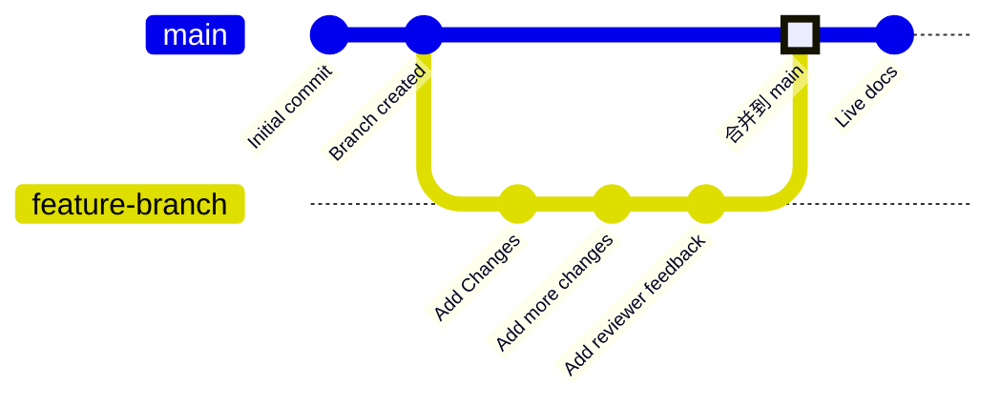

Branch 是版本控制的一项功能，用于指向存储库中特定的提交。你的部署用分支，通常称为 `main`，代表用于构建在线文档站点的内容。除非你选择将其合并到部署用分支，否则所有其他 branch 都与在线文档相互独立。

Branch 使你可以为文档创建独立实例，以进行更改、获取评审，并在发布前尝试新方案。你的团队可以在不同 branch 上同时更新文档的不同部分，而不会影响用户在在线站点上看到的内容。

下图展示了一个 branch 工作流示例：在该流程中创建一个功能 branch，完成更改后，再将该功能 branch 合并回 main branch。



我们建议在更新文档时始终基于 branch 开展工作，以保持在线站点稳定，并支持评审流程。


<div id="branch-naming-conventions">
  ## Branch 命名规范
</div>

使用清晰、具有描述性的名称来说明该 branch 的用途。

**推荐使用**：

- `fix-broken-links`
- `add-webhooks-guide`
- `reorganize-getting-started`
- `ticket-123-oauth-guide`

**避免使用**：

- `temp`
- `my-branch`
- `updates`
- `branch1`

<div id="create-a-branch">
  ## 创建 branch
</div>

<Tabs>
  <Tab title="使用 Web 编辑器">
    1. 点击编辑器工具栏中的 branch 名称。
    1. 点击 **New Branch**。
    1. 输入一个有描述性的名称。
    1. 点击 **Create Branch**。
  </Tab>

  <Tab title="使用本地开发环境">
    <Steps>
      <Step title="在终端中创建一个 branch">
        ```bash
        git checkout -b branch-name
        ```
        
        这一条命令会创建该 branch 并同时切换到它。
      </Step>
      <Step title="将 branch 推送到 GitHub">
        ```bash
        git push -u origin branch-name
        ```

        `-u` 参数会设置跟踪，这样之后推送时只需要运行 `git push` 即可。
      </Step>
    </Steps>
  </Tab>
</Tabs>

<div id="save-changes-on-a-branch">
  ## 在 branch 上保存更改
</div>

<Tabs>
  <Tab title="使用 Web 编辑器">
    在编辑器工具栏右上角选择 **Save as commit** 按钮。这会创建一个提交，并自动将你的更改推送到你的 branch。
  </Tab>

  <Tab title="使用本地开发环境">
    暂存、提交并推送你的更改。

    ```bash
    git add .
    git commit -m "Describe your changes"
    git push
    ```
  </Tab>
</Tabs>

<div id="switch-branches">
  ## 切换 branch
</div>

<Tabs>
  <Tab title="使用 Web 编辑器">
    1. 在编辑器工具栏中选择 branch 名称。
    1. 在下拉菜单中选择要切换到的 branch。

    <Warning>
      切换 branch 时，未保存的更改将会丢失。请先保存你的工作。
    </Warning>
  </Tab>

  <Tab title="使用本地开发环境">
    切换到已有的 branch：

    ```bash
    git checkout branch-name
    ```

    或者使用一条命令创建并切换：

    ```bash
    git checkout -b new-branch-name
    ```

  </Tab>
</Tabs>

<div id="merge-branches">
  ## 合并 branch
</div>

当你的更改准备好发布时，创建一个拉取请求（PR；亦称“合并请求”/Merge Request），将你的 branch 合并到部署用分支。