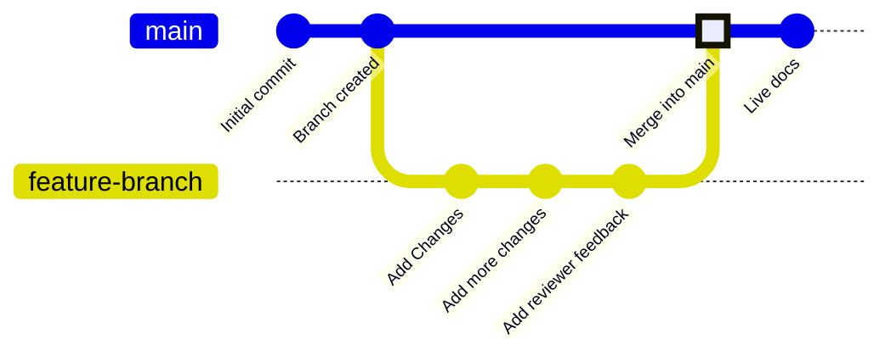

Branch 是版本控制的一项功能，用于指向仓库中特定的 commit。你的 deployment branch，通常称为 `main`，代表用于构建线上文档站点的内容。除非你选择将其合并到 deployment branch，否则所有其他 branch 都与你的线上文档相互独立。

Branch 使你可以为文档创建独立实例，以进行更改、获得审阅，并在发布前尝试新方案。你的团队可以在不同 branch 上同时更新文档的不同部分，而不会影响用户在线上站点上看到的内容。

下图展示了一个 branch 工作流示例：你创建一个 feature branch、进行更改，然后把 feature branch 合并回 main branch。


```mermaid
gitGraph
    commit id: "Initial commit"
    commit id: "Branch created"
    branch feature-branch
    checkout feature-branch
    commit id: "Add Changes"
    commit id: "Add more changes"
    checkout main
    checkout feature-branch
    commit id: "Add reviewer feedback"
    checkout main
    merge feature-branch id: "Merge into main" type: HIGHLIGHT
    commit id: "Live docs"
```

在更新文档时始终基于 branch 开展工作，以保持你的线上站点稳定，并支持审阅工作流。

<div id="branch-naming-conventions">

## Branch 命名规范

</div>

使用清晰、具有描述性的名称来说明 branch 的用途。

**推荐使用**：

- `fix-broken-links`
- `add-webhooks-guide`
- `reorganize-getting-started`
- `ticket-123-oauth-guide`

**避免使用**：

- `temp`
- `my-branch`
- `updates`
- `branch1`

<div id="create-a-branch">

## 创建 branch

</div>

<Tabs>
  <Tab title="使用网页编辑器">
    1. 点击编辑器工具栏中的 branch 名称。如果看不到它，请[显示分支选择器](/zh/editor/publish#show-the-branch-selector)。
    1. 在 **Find a branch** 中输入具有描述性的标题。如果留空，编辑器会以当前日期为该 branch 命名。
    1. 点击 **New branch**。
    1. 如果你有待处理更改，请选择 **Bring them to this branch** 或 **Leave them behind**。无论哪种选择，你的原始 branch 都会保留其待处理更改。
  </Tab>
  <Tab title="使用本地开发环境">
    <Steps>
      <Step title="在终端中创建一个 branch">
        ```bash
        git checkout -b branch-name
        ```

        这一条命令会创建该 branch 并同时切换到它。
      </Step>
      <Step title="将 branch 推送到 GitHub">
        ```bash
        git push -u origin branch-name
        ```

        `-u` 参数会设置跟踪，这样之后 push 时只需要运行 `git push` 即可。
      </Step>
    </Steps>
  </Tab>
</Tabs>

<div id="save-changes-on-a-branch">

## 在 branch 上保存更改

</div>

<Tabs>
  <Tab title="使用网页编辑器">
    你无需手动保存。编辑器会在你停止编辑约 15 秒后将你的编辑 commit 到 branch。首次 commit 会打开一个针对 deployment branch 的 pull request。
  </Tab>
  <Tab title="使用本地开发环境">
    暂存、commit 并 push 你的更改。

    ```bash
    git add .
    git commit -m "Describe your changes"
    git push
    ```
  </Tab>
</Tabs>

<div id="switch-branches">

## 切换 branch

</div>

<Tabs>
  <Tab title="使用网页编辑器">
    1. 点击编辑器工具栏中的 branch 名称以打开 branch 下拉菜单。
    1. 按名称搜索 branch 或滚动浏览列表。
    1. 点击要切换到的 branch。

    下拉菜单中的每个 branch 都会显示 pull request 指示器，便于你查看该 branch 的 pull request 是处于打开、草稿、已合并还是已关闭状态，或者尚未创建 pull request。

    在开始搜索之前，下拉菜单会列出在编辑器中创建的 branch，以及有指向 deployment branch 的打开 pull request 的 branch。按名称搜索还可以匹配仓库中的其他 branch，包括直接通过 Git push 的 branch，以及 pull request 已合并或已关闭的 branch。请参阅[网页编辑器分支列表中缺少分支](/zh/help-center/branch-missing-from-editor-branch-list)。

    你的待处理更改会保留在你离开的 branch 上。
  </Tab>
  <Tab title="使用本地开发环境">
    切换到已有的 branch：

    ```bash
    git checkout branch-name
    ```

    或者使用一条命令创建并切换：

    ```bash
    git checkout -b new-branch-name
    ```
  </Tab>
</Tabs>

<div id="merge-branches">

## 合并 branch

</div>

当你的更改准备好发布时，将你的 branch 合并到 deployment branch。

<Tabs>
  <Tab title="使用编辑器">
    如果 Mintlify 托管你的仓库并且你的 branch 不要求审批，请点击编辑器工具栏中的 **Publish**，然后再点击 **Publish** 以合并你的 branch 并发布更改。

    否则：

    1. 点击编辑器工具栏中的 **Publish**，然后点击 **Request review**。这会将 branch 的 pull request 标记为可供审阅。
    1. 完成所有必需的审阅和检查。
    1. 点击 **Publish**，然后点击 **Merge and publish**。

    关于可用的发布操作如何随你的 branch 和分支保护而变化，请参阅[发布你的更改](/zh/editor/publish)。
  </Tab>
  <Tab title="使用本地开发环境">
    push 你的 branch，然后在你的 Git 提供方中打开一个以 deployment branch 为目标的 pull request。pull request 合并后，Mintlify 会构建你的更改并将其部署到你的线上站点。
  </Tab>
</Tabs>

<div id="delete-a-branch">

## 删除 branch

</div>

删除不再需要的 branch，让 branch 下拉菜单保持易于管理。

<Tabs>
  <Tab title="使用网页编辑器">
    1. 点击编辑器工具栏中的 branch 名称以打开 branch 下拉菜单。
    1. 将鼠标悬停在要删除的 branch 上。
    1. 点击 **Delete branch** 垃圾桶图标。
    1. 点击 **Delete branch** 进行确认。

    删除 branch 会关闭该 branch 上所有打开的 pull request，并从你的仓库中删除该 branch。你无法删除你的 deployment branch。
  </Tab>
  <Tab title="使用本地开发环境">
    在本地删除该 branch：

    ```bash
    git branch -d branch-name
    ```

    然后从远程仓库中删除它：

    ```bash
    git push origin --delete branch-name
    ```
  </Tab>
</Tabs>
