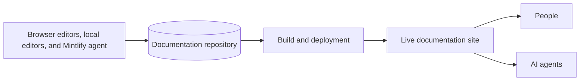

Mintlify 会将 Git 存储库中的内容构建成一个文档站点。你可以在浏览器中的编辑器里工作，在本地开发环境中工作，或者在 Slack 中向 Mintlify agent 发送提示。这三种工作流都会更新同一个存储库。Mintlify 会将存储库中的内容构建为面向人类和 agent 的优化体验。

  ## 组织、部署和站点

**组织** (organization) 是你的团队的工作空间。它包含你的成员、组织级别的设置以及一个或多个部署。

**部署** (deployment) 是你组织中的一个文档项目。它将一个存储库、内容目录和部署分支连接到一个已发布的站点。一个组织可以为不同的产品或文档资产拥有多个部署。

**在线站点** (live site) 是一个部署所发布的产物。Mintlify 默认提供一个 `.mintlify.site` 的 URL。你可以为你的站点连接一个[自定义域名](/zh/customize/custom-domain)。站点包含你的内容、导航、搜索，以及你启用的任何功能，例如 AI 助手或 API playground。

<Note>
  本文档有时会用 **project** 作为一个部署及其关联的存储库、配置和站点的通用名称。
</Note>

  ## 存储库是权威信息源

你的文档存储库中包含定义站点的文件。Mintlify 会在每次构建时读取这些文件。

- **页面** (pages) 是 `.mdx` 文件。每个页面都包含内容和 frontmatter 元数据。
- `docs.json` 是必需的配置文件。它控制导航、外观、集成、API 设置以及其他站点级的行为。
- **资源** (assets) 包括页面中引用的图片、视频、字体和可下载文件。
- **API 规范** (API specifications) 可以基于 OpenAPI、AsyncAPI 或 GraphQL schema 生成 API 参考页面和交互式 playground。
- **可复用文件** (reusable files) 包括 snippets 和自定义 React 组件，页面可以导入使用。

你的存储库中可以包含未发布的文件。只有当你在 [`docs.json`](/zh/organize/navigation) 的导航中引用某个页面时，该页面才会出现在站点导航中，否则会被隐藏。[隐藏页面](/zh/organize/hidden-pages) 只能通过直接链接访问。

  ## 页面和导航是分离的

**页面** (page) 提供某个 URL 上的内容。其 [frontmatter](/zh/organize/pages) 控制页面级的元数据和行为，包括标题、描述、图标和布局。

**导航** (navigation) 决定读者如何在页面之间浏览。你可以在 `docs.json` 文件中使用分组、标签、下拉菜单、产品、版本和语言等元素来配置导航。文件路径决定了页面是哪个，而它在 `docs.json` 中的位置决定了它在导航中的位置。

这种分离让你无需移动文件就能重新组织读者的浏览体验。它还允许你将某些工具类页面从导航中排除，同时保留通过 URL 访问的能力。

  ## 编辑和发布是不同的阶段

你可以通过两种主要工作流来编辑同一份内容。

| 工作流 | 在哪里编辑 | 更改如何进入 Git | 如何预览 |
| --- | --- | --- | --- |
| Editor | 浏览器中的 Mintlify 控制台 | 编辑器会创建提交，并且可以打开拉取请求 | 在编辑器中实时预览 |
| 本地开发 | 你偏好的编辑器 | 你使用 Git 提交并推送 | `mint dev` CLI 命令 |

在编辑器中，更改会自动**保存**，但不会立即更新你的存储库或在线站点。当你**发布**时，编辑器会将更改写入 Git。之后发生的事情取决于你当前所在的分支和分支保护设置。

- 在**部署分支**上，发布可以直接触发在线站点的构建。
- 在**功能分支**上，发布可以将更改保存到该分支，或创建一个拉取请求以供审核。
- **预览部署**会将拉取请求渲染到一个临时 URL，以便审核者在合并前检查结果。
- 将拉取请求合并到部署分支会触发一次生产部署。

有关完整工作流，请参阅[分支与发布](/zh/editor/publish)。

  ## 构建会将源文件转换为读者体验

当内容进入部署分支时，Mintlify 会校验项目、渲染页面并部署站点。相同的源内容支持多种查找和消费信息的方式：

- 文档站点会为桌面和移动端用户渲染页面。
- 搜索会为站点建立索引，让读者能够找到相关页面。
- AI 助手可以基于文档回答问题，并注明其信息来源。
- 页面的 Markdown 版本、`llms.txt` 和 `skill.md` 可以帮助 AI 工具理解内容。
- 一个公开的 MCP 服务器让兼容的 AI 工具能够将文档作为结构化上下文来检索。

在发布前运行 [`mint validate`](/zh/cli/commands#mint-validate) 和 [`mint broken-links`](/zh/cli/commands#mint-broken-links)，可以在本地捕获常见问题。

  ## Mintlify 的 AI 功能各有不同的角色

Mintlify 为阅读、写作、自动化以及外部工具访问分别提供了不同的 AI 功能。

| 功能 | 使用者 | 用途 | 是否更改内容 |
| --- | --- | --- | --- |
| [Assistant](/zh/assistant) | 文档读者 | 基于你的内容回答问题 | 否 |
| [Agent](/zh/agent) | 文档维护者 | 研究并提出内容或配置更新建议 | 是 |
| [Automations](/zh/automations/index) | 文档维护者 | 按计划、存储库更新或集成事件运行 agent | 是 |
| [Search MCP server](/zh/ai/model-context-protocol) | Agents | 从单个已发布的文档站点检索上下文 | 否 |
| [Admin MCP server](/zh/ai/mintlify-mcp) | Agents | 通过经过认证的工具读取和更新部署 | 是 |
| [Mintlify Index](/zh/search-index) | Agents | 检索所有公开的 Mintlify 站点和网络上最新的技术上下文 | 否 |

  ## 了解术语

请参阅[术语表](/zh/reference/glossary)，其中包含本文档中使用的 Mintlify、Git、发布、导航、API 和 AI 相关术语的定义。
