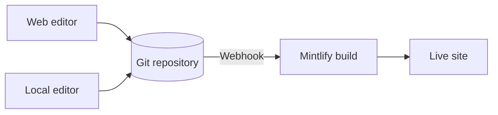

Mintlify 将你的内容托管为网站。你的内容以 MDX 文件的形式存储在 Git 仓库中，当你推送更改时，Mintlify 会自动构建和部署你的网站。

  ## Mintlify 项目的三个部分

**你的仓库**是文档的唯一真实来源。它包含每个页面的 MDX 文件和一个配置网站导航、主题和设置的 `docs.json` 文件。你可以使用自己的 GitHub 或 GitLab 仓库，也可以让 Mintlify 在入门时为你创建一个。

**Mintlify 控制面板**连接到你的仓库，让你管理网站。使用它来监控部署、配置设置、管理团队，以及直接在浏览器中编辑内容。

**你的网站**由 Mintlify 驱动。Mintlify 从你的仓库构建网站，默认部署在 `.mintlify.app` URL 上。当你准备好时，可以将自定义域名指向你的网站。

  ## 编辑内容

有两种方式编辑你的内容，你可以自由切换。

- **Web 编辑器**：在浏览器中编辑和发布页面。编辑器会自动将更改提交回你的 Git 仓库。
- **CLI 和本地编辑器**：克隆你的仓库，运行 `mint dev` 在本地预览网站，然后推送更改进行部署。

多个团队成员可以同时在任一工作流程中工作，使用 Git 分支管理并行更改。任何能够推送到你仓库的人都可以更新你的内容。

  ## AI 功能

内置的 AI 功能帮助人类和 AI 查找和理解你的内容，并帮助你维护内容。

**助手**让你的用户可以提问并从你的内容中获得带引用的答案。

**代理**通过从计划的工作流程、合并到功能仓库的拉取请求或 Slack 线程生成更新，帮助你的团队创建和维护内容。

参阅 [AI 原生文档](/zh/ai-native) 了解所有 AI 功能的概述。

  ## 下一步

<Card title="快速入门" icon="rocket" horizontal href="/zh/quickstart">
  几分钟内部署你的第一个文档网站。
</Card>
