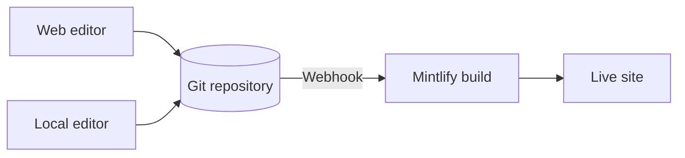

Mintlify 会将你的内容托管成一个网站。你的内容以 MDX 文件的形式存放在 Git 存储库中，当你推送更改时，Mintlify 会自动构建并部署你的网站。

  ## 一个 Mintlify 项目的三个组成部分

**你的存储库（repository）** 是文档的权威来源。它为每个页面包含一个 MDX 文件，以及一个 `docs.json` 文件，用于配置站点的导航、主题和其他设置。你可以使用自己的 GitHub 或 GitLab 存储库，或者在初始设置时让 Mintlify 为你创建一个。

**Mintlify 控制台** 会连接到你的存储库，让你管理你的站点。你可以用它来监控部署、配置设置、管理团队，并在浏览器中直接编辑内容。

**你的网站** 由 Mintlify 驱动。Mintlify 会从你的存储库构建站点，并默认将其部署到一个 `.mintlify.app` 的 URL。当你准备就绪时，可以将自定义域名指向你的网站。

  ## 编辑内容

有两种方式可以编辑你的内容，你可以在它们之间自由切换。

* **网页编辑器**：在浏览器中编辑和发布页面。编辑器会自动将更改提交回你的 Git 存储库。
* **CLI 和本地编辑器**：克隆你的存储库，运行 `mint dev` 在本地预览你的网站，然后推送更改以完成部署。

多个团队成员可以同时使用任一工作流，并通过 Git branch 管理并行更改。任何有权向你的存储库推送的人都可以更新你的内容。

  ## AI 功能

内置的 AI 功能可以帮助用户和 AI 查找并理解你的内容，也便于你维护这些内容。

**AI 助手**让你的用户可以提问，并从你的内容中获得带引用的回答。

**Agent** 可以根据计划的工作流、合并到功能存储库的拉取请求（PR；亦称“合并请求”/Merge Request）或 Slack 线程生成更新，从而帮助你的团队创建和维护内容。

参见 [AI 原生文档](/zh/ai-native) 了解所有 AI 功能的概览。

  ## 后续步骤

<Card title="快速开始" icon="rocket" horizontal href="/zh/quickstart">
  几分钟内即可部署您的第一个文档站点。
</Card>